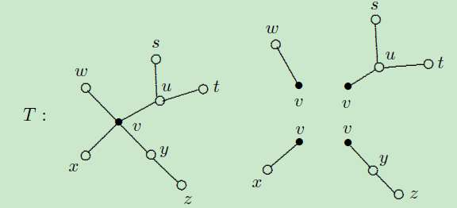

考试重点内容都有加粗！！

# 1.1 基本概念

* 有限图：点集和边集都有限的图

* 平凡图：只有一个顶点而无边的图

* 非平凡图：平凡图除外的所有图

* 空图：边集为空的图称为空图。

* 顶点数==阶数`n(G)`

* 边数`m(G)`

* 边相邻：若两条边有一个共同的端点，则称这两条边相邻

* 重数：连接两个相同顶点的边的条数，叫做边的重数。

* 重边：重数大于1的边称为重边。

* 孤立点：不与任何边相关联的点；

* 环：两端点重合的边；

* **简单图（单图）**：既没有环也没有重边的图

* 复合图：除简单图之外的所有图都是复合图

* **图的同构**：点对应、边对应，两个图完全一样！`A ≅ B`

  * 图同构的几个必要条件:1. 顶点数相同；2. 边数相同；3. 度数相等的顶点个数相同。

* 完全图：任意两点均相邻的简单图称为完全图，用 $K_n$ 表示

* **偶图（二分图）**：可二分类 `(X, Y)` 的图，**每条边的顶点均不属于同一类**！指该图的点集可以分解为两个(非空)子集 X和 Y ，使得每条边的一个端点在 X 中，另一个端点在Y 中。

* 完全偶图：不是完全图！是指具有二分类(X, Y)的简单偶图，其中 X的每个顶点与 Y 的每个顶点相连记 $K_{m,n}$

  

* **补图**：完全图 - 当前图

* 顶点的度： `d(v)`​ G 中与 v 为端点的边的条数(环计算两次)称为点 v 的度数

* 非标定(号)图: 在图的图形表示中我们可以不给图的点和边标上符号，称这样的图为非标定(号)图，否则称为标定(号)图

* 最小度：`δ(G)`

* 最大度：`∆(G)`

* 奇点：度数为奇数的点

* 偶点：度数为偶数的点

* k-正则图：每个点的度均为 k 的简单图，完全图与$k_{n,n}$完全偶图均是正则图！

* **度序列**：图中各个顶点的度构成的非负正数组：$(d_1, ...d_n)$ 

* **可图（对整数组而言）**：存在一个**简单图**以它为度序列

* 可图序列：简称**图序列**

* 频序列：非负整数组$(b_1, ...b_s)$，其中$b_i$表示G的顶点中度为$d_i$(不重要)的顶点的个数

## 定理、推论

* **定理1（自补图）**：若n阶图是自补的（$G\cong \bar G$)，则$n=0,1 (mod~4)$

  

      
证明（完全图的边数）

      
  

* 定理2（握手定理）：`G`中所有顶点的度数和等于边数m的2倍：$\sum d(v)=2m$

* 推论1：在任何图中，奇点个数为偶数

  

      
证明（根据握手定理）

      
  

* 推论2：正则图的阶数（点的度数）和**度数**不同时为奇数（推论1）

* 定理：一个简单图的n个点的度不能互不相同
  
  

      
证明

      
  

  
* 定理5：可图的充要条件！

  

  

      
举例

      
  

* 定理5：一个n阶图和它的补图有相同的频序列

# 1.2 子图

* 子图：原图中的一部分顶点+部分边构成的图（集合中的子集）

* 真子图：（集合中的真子集，不能和原图相同）

* 生成子图：顶点与原图相同，边为原图边的子集

* 导出子图：顶点为原图非空子集$V'$，以及原图中所有以$V'$中顶点为两端的边，记$G[V']$。

* 边导出子图：边为原图的非空子集，以及边对应的顶点，记$G[E']$。
  
  

      
举例

      
  

设G1 ，G2 是G 的子图，有下列术语与概念

* G1 和G2 不相交: 指它们无公共顶点.

* G1 和G2 边不重 : 指它们无公共边.

* 并图G1 ⋃ G2：顶点、边集相并。如果G1 和G2 是不相交的，有时候就记其并图为G1 + G2 。

* 交图G1 ⋂ G2：顶点、边集的交集。

* 差G1 - G2 ：G1去掉G2中的边组成的图

* 对称差：G1 △ G2 : G1 △ G2 = (G1 ⋃ G2 ) - (G1 ⋂ G2 ) = (G1 -G2 ) ⋃ (G2 -G1 )
  
  

      
举例

      
  

  
* **联图 G1 ∨ G2** ：G1， G2不相交，把G1的每个顶点与G2的每个顶点连起来

* **积图**：

  

* `u adj v`表示`u`和`v`邻接

* 合成图：

  

* 联合：把G1 的一个顶点和G2 的一个顶点粘合在一起后得到的新图称为G1 与G2 的联合。记为: G1 V G2

* 方体：

## 定理、推论

* 定理6：简单图 G 中所有不同的生成子图（包括 G 和空图）的个数是$2^m$个

# 1.3 路与连通性

* 途径：v0点边点边点边点边....点边点vk。长度为经过边的条数。记 (v0, vk)途径

* 迹：边不重复的途径

* 路：点不重复的途径。显然路必为迹。

* 闭途径：起点终点相同，长为正

* 回路：即**闭迹**（闭途径+边不重复）

* 圈：起点和内部顶点(非起点和终点的点)两两不相同的闭迹

* k 圈：长为 k 的圈，奇圈、偶圈

* 点u与v的距离：指图中最短 (u, v) 途径的长度，记为 `d(u, v)`

* 图的直径：d(G)=max {d(u, v) | $u, v \in V$}

* 点连通：存在路

* 连通图：G中任意两个顶点均连通的图。

* 非连通图：不是连通图的图。

* 连通分支：连通的极大子图，用 $\omega(G)$ 记图 $G$ 的连通分支数。

  

## 定理、推论

* 定理7：若图G不连通，则$\bar G$是连通图。
  

      
证明

      
  

* 定理8：一个图是偶图，当且仅当它不包含奇圈。
  

      
证明

      
      
  

  

# 1.4 最短路算法

1. Dijkstra算法[ref](https://zhuanlan.zhihu.com/p/40338107)

# 1.5 图的代数表示

* 邻接矩阵：行列均为顶点
    * 非负对称方阵
    * 行（列）元素之和对应顶点的度数
    * 同一图的不同形式的邻接矩阵是相似方阵
    * 图连通当且仅当邻接矩阵无约化形式：
      
* 关联矩阵：行为边，列为顶点
    * 元素为0，1或2（环）
    * 列和为2，行和对应顶点的度数
    * 
* 邻接代数：给定图G ，容易验证G 的邻接矩阵的全体复系数多项式在通常的矩阵运算下构成一个有限维的线性空间，它也是一个代数，称为图G的邻接代数，记为 Λ(G)
* 邻接谱：图的邻接矩阵A(G)的特征多项式的特征值及其重数，称为G的邻接谱。
    * $\operatorname{Spec} A=\left[\begin{array}{llll}\lambda_{1} & \lambda_{2} & \cdots & \lambda_{s} \\ m_{1} & m_{2} & \cdots & m_{s}\end{array}\right]$ 为 $A$ 的谱
* 同谱图：若两个非同构的图具有相同的谱

## 定理、推论

* $l$部图：若简单图G的点集 $V$ 有一个划分
    $$
    \boldsymbol{V}=\bigcup_{i=1}^{l} V_{i}, \boldsymbol{V}_{i} \cap \boldsymbol{V}_{\boldsymbol{j}}=\boldsymbol{\Phi} \quad i \neq j
    $$
    且所有 $V_{i}$ 非空， $V_{i}$ 内的点均不相邻，则称G是一个 $l$ 部图。
    

    * 如果$l$=2，则G就是偶图
    * 任何一个n阶图必是一个n部图
    * 若$l_1<l_2\leq n$易知任意的$l_1$部图也是$l_2$部图。

* 完全$l$部图：类比完全偶图

* **托兰定理**：若n阶简单图G不包含K_{l+1}，则G度弱于某个完全 `l` 部图 H，且若G具有
    与 H 相同的度序列，则: G $\cong$ H
    
* 
  
* 设G和H是两个n阶图，称G度弱于H，如果存在双射 $\mu: \mathrm{V}(\mathrm{G}) \rightarrow \mathrm{V}(\mathrm{H}),$ 使得:
    $$
    \forall v \in V(G), \text { 有 }: \quad d_{G}(v) \leq d_{H}(\mu(v))
    $$

# 2.1 树的概念

* **树**：连通的无圈图，树常用字母T 表示

* **森林**：无圈图称为森林，树也是森林

  * 树叶：树中度为1的顶点
  * 分支点：树中度数大于1的顶点
  * 平凡图也是树，称为平凡树
  * 树与森林都是偶图
  * 树与森林都是单图
  
* 最小连通图：设图G是一个非平凡的无向连通图，如果对G中每一条边e，G-e都不连通

* **根树**：要把一个家族的繁衍情况简洁直观表达出来，用点表示家族中成员，成员x是成员y的儿女，把点x画在点y的下方，并连线。如此得到的图，是一颗树，称为根树。

  

* **完全m元树**：对于根树T，若每个分支点至多m个儿子，称该根树为m元根树；若每个分支点恰有m个儿子，称它为完全m元树。

## 定理、推论

* 定理1：设G是具有n个点m条边的图，则以下关于树的命题等价。

  * (1) G 是树。
  * (2) G 中任意两个不同点之间存在唯一的路。
  * (3) G 连通，删去任一边便不连通。
  * (4) G 连通，且 m = n-1。
  * (5) G 无圈，且 m = n-1 。
  * (6) G 无圈，添加任一条边可得唯一的圈。

* 推论1：由k棵树组成的森林满足:m = n-k。其中n为G的顶点数，m为G的边数。

* 推论2 每棵非平凡树至少有两片树叶。
  

      
证明

      
  

* 定理2 非平凡的无向图G是树的充要条件是G为最小连通图。

* 树的度序列判定：设S={d1, d2, ... , dn }是n个正整数序列，它们满足：d1 ≥ d2 ≥ ... ≥ dn, ∑di = 2(n-1)。则存在一颗树T，其度序列为S。

# 2.2 树的中心与形心

* 图的顶点的离心率 e(v) = max{ d(u, v) | u $\in$ V(G) }
* 图的半径：最小的离心率  r(G) = min{ e(v) | v $\in$ V(G) }
* 图的直径：最大离心率。
* **图的中心点**：离心率等于半径的点。
* **图的中心**：中心点的集合。
* 定义2：设T是树，u是树T的任意一个顶点，树T在点u处的一个分枝:包含u作为一个叶点的极大子树，其分枝数等于该顶点的度数；
* 点u的权: 树T在点u的分枝中边的最大数目；
* 形心点:树T中权值最小的点。
* 形心:树T的全体形心点的集合。

## 定理、推论

* 定理7：每棵树的中心由一个点或两个相邻点组成。

  

* 定理6 每一棵树有一个由一个点或两个邻接的点组成的形心。

# 2.3 生成树

* 图G的一个生成子图T如果是树，称它为G的一棵生成树
* 若T为森林，称它为G的一个生成森林。
* 生成树的边称为树枝，G中非生成树的边称为弦
* 

## 定理、推论

* 定理5 连通图的生成树必存在。
  * 注:连通图G的生成树一般不唯一!
  * 用τ(G)表示G的生成树棵数。
* 推论 若G是(n, m)连通图，则`m ≥ n-1`
* 定理2 (Cayley) 设e是G的一条边，则有: τ(G) = τ(G − e) + τ(G!!!!e)
* 定理3 设Am 是连通图G的基本关联矩阵的主子阵，则A m 非奇异的
* 定理4（矩阵树定理）

# 2.4 最小生成树

* **克鲁斯克尔Kruskal算法**：按边权排序，依次加入（保证不含圈）
  * (1) 将G 的边按权从小到大排列，不妨设为e1, e2, ... , em
  * ( 2 ) 取T = {e 1 }，再从e 2 开始依次将排好序的边加入到T 中，使加入后由T 导出的子图(即由T 作为边集，T 中的边相关联的点作为点集所确定的子图)不含圈，直至T 中含有n-1条边。
* **Prim算法**：
  * (1)选取连通赋权图G的任意一个顶点u，选择与点u关联的且权值最小的边作为最小生成树的第一条边e 1 ；
  * (2)在接下来的边e 2 ,e 3 ,...,e n-1 ，在与一条已经选取的边只有一个公共端点的所有边中，选取权值最小的边。
* **破圈法**：从赋权图G的任意圈开始，去掉该圈中权值最大的一条边，称为破圈

# 3.1 割边、割点、块

* 顶点割$V'$：顶点子集$V'$，有$G-V'$不连通
* k-顶点割：$V'$中有k个顶点
* 最小点割：G中顶点数最小的顶点割
  * 完全图没有顶点割
  * 实际上只有以完全图为生成子图的图没有顶点割
  * 若`G`是非平凡连通图，则`v`是G的割点，当且仅当{v}是G的1-顶点割。
* 连通度（对n阶连通图）：`G`的连通度记为`k(G)`，简记为k
  * 若G存在顶点割，则称`G`的最小顶点割中的点数为G的连通度
  * 否则称 n-1 为其连通度
  * 对非连通图G定义 k(G)= 0
* 边连通度：$\lambda (G)$
  * 在G中，最小边割集所含边数称为G的边连通度。边连通度记为$\lambda (G)$
  * 若G不连通或G是平凡图，则定义$\lambda (G)=0$
* 若 $k(G) \geq k$，称G是k连通的
* 若 $\lambda(G) \geq k$，称G是k边连通的

## 定理、推论

* 定理1：对任意图，有$k(G) \leq \lambda (G) \leq \delta (G)$
* 定理2：设G是(n, m)连通图，则$k(G) \leq \lfloor 2m/n \rfloor$
* 定理3：设G是(n, m)单图，若$\delta (G) \geq \lfloor n/2 \rfloor$，则G连通
* 定理4：设G是(n, m)单图，若对任意整数k，有：$\delta (G) \geq \lfloor (n+k-2)/2 \rfloor$，则G是k连通的
* 定理5：设G是n 阶单图，若$\delta (G) \geq \lfloor n/2 \rfloor$，则有$\lambda (G)=\delta (G)$
* 定理10：
  * (1)设:和是图G中的两个不相邻点，则G中分离和y的   **最少点数=独立的(x,y)路的最大数目**。
  * (2)设:和y是图G中的两个不同点，则G中分离:和y的   **最少边数=边不重的(x,y)路的最大数目**。
* 推论1：
  * 推论1对$k\geq 2$，图G是k连通的当且仅当G至少有k+1个点并且G中任意两个不同顶点间均存在k条独立路；
  * G是k边连通的当且仅当G至少有k个点并且G任意两个不同项点间均存在k条边不重的路。
* 推论2：设G是阶至少为3的图，则以下三个命题等价。
  * (1) G是2连通的。
  * (2) G中任意两点都位于同一个圈上
  * (3) G无孤立点且任意两条边都在同一个圈上

# 3.4 图的宽距离和宽直径

* 路族：设$x, y \in V(G)$，$C_w(x,y)$表示G中w条**内点不交**路的路族

# 4.1 欧拉图

定义1 设G是无孤立点的图

* 经过G的每条边的(内)迹被称为**Euler(闭)迹**
* 存在Euler闭迹的图称为**欧拉图**，简称**E图**
* Euler闭迹又称为**Euler环游**

定义2 有向图D中

* 以一点`u`为起点的弧的数目称为`u`的**出度**，记为$d_D^+(u)$
* 以一点`u`为终点的弧的数目称为`u`的**入度**，记为$d_D^-(u)$

中国邮路问题：快递员从邮局出发，递送邮件，然后返回邮局，要求辖区每条街至少走一次且走过的总路程最短，应如何选择路线?

* 最优环游：在一个连通的具有非负权的赋权图G中找一条包含每条边(允许重复)且边权之和最小的闭途径。
  * 若G是Euler图，则G的任何Euler环游都是最优环游
  * 对一般图，其解法为：添加重复边以使G成为欧拉图`G'`，并使添加的重复边的边权之和为最小，再求`G'`的欧拉回路。
  * 对恰有两个度数为奇的点的图G，可证：**需要重复的边**正好是从一个奇度点到另一个奇度点的最短路上的边，即问题为欧拉问题与最短路问题的综合。
    

## 定理推论

* 定理1（判定欧拉图）：下列陈述对于一个连通图G是等价的
  * G是欧拉图。
  
  * **G的每个点的度是偶数。**
  
  * **G的边集能划分为圈（边集可划分为一个个无重边的圈）**。
  
    
  
* 推论（判断欧拉迹） ：

  * 连通图G有Euler迹 <==> G最多有两个奇点；

  * 连通图G有Euler迹 <==> G能一笔画；

  * 若奇点数为0，则一笔画与起点无关

  * 若奇点数为2，则一笔画的起点与终点均为奇点

    

* 定理2（判断欧拉有向图）：下列陈述对于一个连通有向图D是等价的
  * D是欧拉有向图。
  * D的每个点的入度等于出度。
  * D的弧集可划分为有向圈。
  
* 定理3（最优环游）：若W是图G中一条包含所有边的闭通道，则W在这样的闭通道中具有最短的长度的充要条件是：
  * 每一条边最多重复经过一次
  
  * 在G的每一个圈上，重复经过的边的数目不超过圈的长度的一半
  
    
  
* 定理4（赋权图--最优环游）：若W是包含图G的每条边至少一次的闭途径，则W具有最小权值当且仅当下列两个条件被满足：

  * G的每条边在W中最多重复一次；

  * 对于G的每个圈上的边来说，在W中重复的边的总权值不超过该圈非重复边总权值 。

    

## 算法

* **Fleury算法：Euler图中确定Euler环游**
  * 从任一点出发按下法来描画一条边不重复的迹，使在每一步中未描画的子图的**割边**仅当没有别的边可选择时才被描画。

# 4.4 哈密尔顿图

* Hamilton路（圈）：经过图中每个点仅一次的路（圈）
* 哈密尔顿图：存在Hamilton圈的图，简称H图
* H路：Hamilton路也简称H路

## 定理推论

* 定理1（H图必要非充分条件）：若G为H图，则对`V(G)`的任一非空顶点子集S有：$w(G-S) \leq |S|$
* 判定图是否是H图，为NP-Hard难题
* 定理2（充分条件）：对于$n\geq 3$的简单图G，若G中有：$\delta(G) \geq n/2$，G是H图
* 定理3（充分条件）：对于$n\geq 3$的单图G，若G中任意两个不相邻顶点u和v，有$d(u)+d(v) \geq n$，G是H图
* 定理4（充要条件）：一个简单图G是H图的充要条件为它的闭包$\hat{G}$是H图
* 定理5（度序列判定法）：

# 4.5 闭图

* 闭图：在n阶简单图G中，若对$d(u)+d(v) \geq n$的任何一对点u和v均有` u adj v`
* 闭包：若一个与G有相同点集的闭图$\hat{G}$，使$G \subset \hat{G}$，且对异于$\hat{G}$的任何图H，若有$G \subset H \subset \hat{G}$，则H不是闭图，则称$\hat{G}$是G的闭包。
* G的闭包是包含G的极小闭图。
* 闭包的构造方法: 将图中度数之和至少是图的顶点个数的非邻接顶点对递归地连接起来，直到不再有这样的顶点对存在时为止。
* 一个图的闭包不一定是完全图。

## 定理推论

* 引理2：若`G1`和`G2`是同一个点集V的两个闭图，则$G = G1\cap G2$是闭图。
* 引理3：图G的闭包是唯一的。
* 定理7：一个简单图G是H图的充要条件为它的闭包$\hat{G}$是H图。
* 推论1：设G是$n \geq 3$的简单图，若$\hat{G}$是完全图，则G是H图。
* 推论2：设G是$n \geq 3$的简单图，若G中每个点的度$d(v)\leq n/2$，则G是H图。
* 推论3：设G是$n \geq 3$的简单图，若G中任何两个不邻接的点u和v，均有$d(u)+d(v) \geq n$，则G是H图。

# 4.6 最优圈

* 最优圈：在赋权完全图G中求具有最小权的哈密尔顿圈！

# 5.1 偶图匹配

* 匹配：设M是图G的边子集，若任意的$e \in M$，e都不是环，且属于M的边互不相邻，则称M为G的一个匹配。
* (非)饱和点：设M为G的一个匹配，对$v \in V(G)$，若v是M中某边的一个端点，则称v为**M饱和点**，否则称为M非饱和点。
* 最大匹配：含边数最多的匹配。
* 完美匹配：图中的点均为M饱和点的匹配。

# 6.1 平面图

* 可平面图（可嵌入平面）：图G可画在一个平面上使除顶点外边不交叉
* 平面嵌入：可平面图G的边不交叉的一种画法
* 平面图：G的平面嵌入表示的图

定义2：
* 设G是一个平面图，G将所嵌入的平面划分为若干个区域，每个区域的内部连同边界称为G的**面**
* 无界的区域称为**外部面或无限面**
* 每个平面图有且仅有一个外部面
* 设`f`是G的一个面，构成`f`的边界的边数(割边计算两次)称为`f`的次数，记为`deg(f)`
  

* 可嵌入曲面S：若图G能在曲面S上使它的边仅在端点相交，则称图G可嵌入曲面S
* 图G的这样一种画法（若存在）称为G的一个S嵌入
* 对每个曲面S总存在不可嵌入S的图，每个图又存在可以嵌入的某个可定向的曲面
* 一个图可嵌入平面当且仅当它可嵌入球面
* 球极平面射影：
* 如果将一个有n个顶点，m条棱和$\Psi$个面的凸多面体的顶点作为顶点，棱作为边，则这个多面体可视为一个图G，很明显G可嵌入球面，可嵌入平面而得到一个连通的平面图。因而由定理2，凸多面体的顶点数，棱数与面数也满足$n-m + \Psi =2$（欧拉公式）。

* 设G是简单可平面图，如果在G中任意两个不相邻的顶点之间添加一条边所得到的图均为不可平面图，则称G为极大可平面图
* 极大可平面图的平面嵌入称为极大平面图
  * 设G是极大平面图，则G必连通；若G的点数$n\geq 3$，则G无割边。

 

## 定理推论
* 定理1（平面图的次数公式）：设具有m条边的平面图G的所有面的集合为$\Psi$，则
$$
\sum_{f \in \Psi} deg(f)=2 m
$$
* 定理2（Euler公式）：设G是具有n个点m条边$\Phi$个面的连通平面图，则有：$n-m+\Phi = 2$
* 定理3：设G是具有$\Phi$个面k个连通分支的平面图，则$n-m+\Phi = k+1$
* 定理4：设G是具有n个点m条边的连通平面图，$\Psi$是G中所有面的集合，若对任意任意的$f\in \Psi$均有$deg(f)\geq l\geq 3$，则
$$
m \leq \frac{l}{l-2} (n-2)
$$
* 推论1：设简单可平面图G有n个点m条边，具$n\geq 3$，则$m \leq 3n-6$
* 推论2：设G是具有n个点m条边的连通平面图，若G中所有面均为由长度为l的圈围成，则`m(l-2)=l(n-2)`
* 定理5：若G是简单平面图，则$\delta \leq 5$
* 定理6（Platonic）：存在且只存在5种正多面体：正四面体、正方体、正八面体、正十二面体和正二十面体。
* 定理7：一个连通平面图是2连通的，当且仅当它的每个面的边界是圈
* 推论6：若一个平面图是2连通的，则它的每条边恰在两个面的边界上。
* 定理8：设G是至少有3 个顶点的平面图。则G是极大平面图的充分必要条件为G中各面的次数均为3且为简单图。（每个面的边界是三角形）
* 推论：设G是一个

