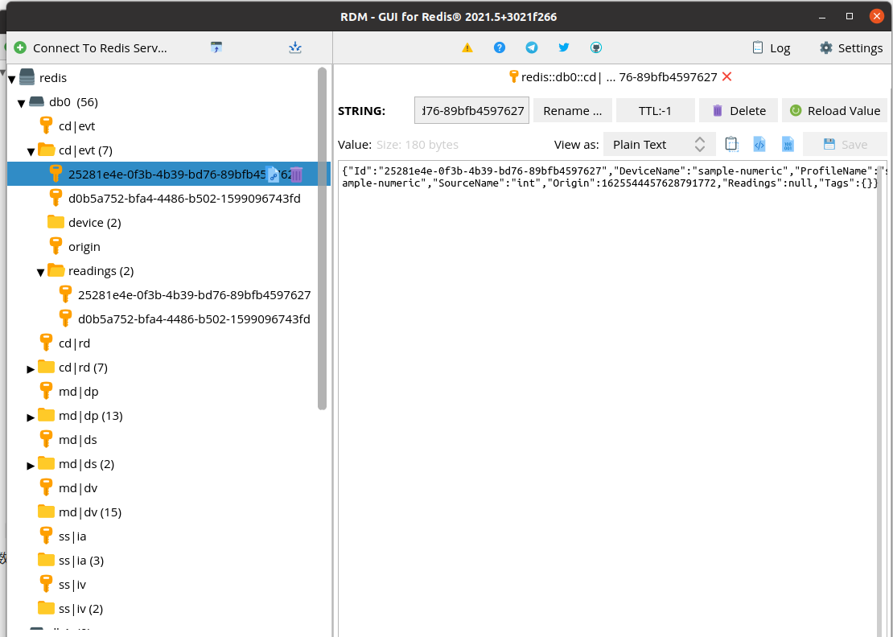

# 1. `docker-compose.yml file`

此部分的example都放在一个专门的`github`仓库中介绍，官方文档[Ireland](https://github.com/edgexfoundry/edgex-compose/tree/ireland)，中文翻译版[Ireland](https://github.com/Yo-gurts/edgex-compose/blob/ireland/README_zh.md)

在本地pull docker镜像时，遇到无法下载的问题，使用的阿里云镜像好像没用了，换了其他镜像，参考此[blog](https://github.com/Yo-gurts/edgex-compose/blob/ireland/README_zh.md)

直接使用`docker-compose-no-secty-with-ui.yml`启动，注释掉里面的`device-virtul`，因为虚拟设备设置了不断上传数据。

#  2. 设备服务

设备服务的文档目前还未更新，官方文档地址：[device profile reference](https://docs.edgexfoundry.org/2.0/microservices/device/profile/Ch-DeviceProfileRef/#device-profile), [metadata-data-models](https://docs.edgexfoundry.org/2.0/microservices/core/metadata/Ch-Metadata/#data-models)

由2.0版本的一些设备服务中的配置文件看，取消了deviceCommands和coreCommands。

`isHidden: false`参数用于将该资源作为**设备命令**，设置为`true`时，只可上传时使用，不可下发命令！

将预定义的设备也从服务的配置文件中独立出来，单独放一个文件中！

2.0设备服务中的配置文件：[device-camera-go](https://github.com/edgexfoundry/device-camera-go/blob/master/cmd/res/profiles/camera-bosch.yaml), [device-rest-go](https://github.com/edgexfoundry/device-rest-go/blob/master/cmd/res/profiles/sample-image-device.yaml)

各类服务重新设计的API文档也已经更新，[device-sdk](https://app.swaggerhub.com/apis-docs/EdgeXFoundry1/device-sdk/2.0.0)，可以看到，比之前简化了一些。

上面的那个链接只是sdk提供的，设备服务在sdk的基础上会增加一下，如device-rest增加了`/api/v2/resource/{deviceName}/{resourceName}`，在其[`README.md`](https://github.com/edgexfoundry/device-rest-go/blob/master/README.md)中有说明！

## 2.1 MESSAGEBUS

2.0版本的EdgeX将MessageBus放在了DeviceService上，所有上传的数据都通过MessageBus发送。

而且现在默认使用的是redis的MessageBus，而不是以前的Zeromq，因为Zeromq不支持多个发布者（设备服务）！

由设备服务的配置文件[configuration](https://github.com/edgexfoundry/device-rest-go/blob/master/cmd/res/configuration.toml#L44)也可以看出，发布的Topic为`edgex/events/device/{profilename}/{devicename}/{sourcename}`	

device-sdk中的[SendEvent](https://github.com/edgexfoundry/device-sdk-go/blob/master/internal/common/utils.go#L54)负责将Event通过MessageBus发布出去。

coredata的服务配置文件[configuration](https://github.com/edgexfoundry/edgex-go/blob/master/cmd/core-data/res/configuration.toml#L48)中，可以指定是否订阅MessageBus，以及订阅的Topic；

订阅Topic只使用前`edgex/events/device/#`部分时，将能接收到全部Event！

`#`类似与`*`，`edgex/events/device/#/devicename/#`表示接收特定设备的数据！

# 3. 数据库

可以看到，现在的数据库更整齐了，数据分类更好！具体怎么实现的不太清楚，不过`cd|evt`，cd表示coredata，md表示metadata，dp表示deviceProfile, evt表示event很好区分！

# 4. 应用服务

MessageBus的主要订阅者就是应用服务，参考此配置文件[configuration](https://github.com/edgexfoundry/app-service-configurable/blob/master/res/sample/configuration.toml#L219)指定其使用的Trigger以及订阅的Topic！

[支持的函数](https://github.com/edgexfoundry/app-service-configurable/blob/master/res/functional-tests/configuration.toml)，由函数名就可大概推测其功能，直接修改配置文件而不用修改代码就可设计出不同功能的应用服务！

# 5. core-services

主要就是API的变化，精简了很多！

* [core-command API Docs](https://app.swaggerhub.com/apis-docs/EdgeXFoundry1/core-command/2.0.0)

* [core-data API Docs](https://app.swaggerhub.com/apis-docs/EdgeXFoundry1/core-data/2.0.0#/)  注册设备不再需要向coredata上传值描述！
* [core-metadata API Docs](https://app.swaggerhub.com/apis-docs/EdgeXFoundry1/core-metadata/2.0.0#/) 上传设备配置文件的返回状态值变了，添加设备的请求体变化较大！

