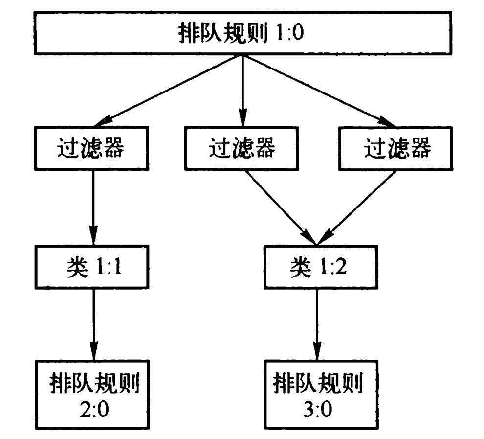
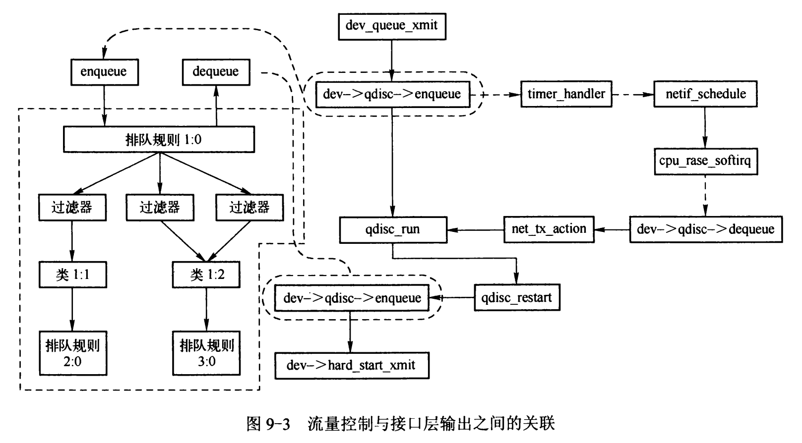

# Linux 网络 Qdisc, Class, Filter

构成流量控制的基本元素有三种，分别是排队规则Qdisc、类Class和过滤器Filter。

类定义在排队规则中，与排队规则紧密关联，可通过排队规则的类来区分报文 。一个分类的排队规则可以拥有多个类，类内再包含排队规则。

过滤器通常用来将输出报文分配到排队规则的分类中。



下图展示了流量控制与接口层输出之间的关联：



## Qdisc

`Qdisc`结构相当于一个排队规则的接口，具体的排队规则如`pfifo, htb`等要实现该接口中定义的函数。

实现一种排队规则的核心是要实现`enqueue`，`dequeue`两个接口，**`dequeue`是决定在此排列规则中，选择哪一个队列（如果有多个队列）的包出队！**

```c
int (*enqueue)(struct sk_buff *skb, struct Qdisc *sch, struct sk_buff **to_free); // 入队接口
struct sk_buff * (*dequeue)(struct Qdisc *sch); // 出队接口
const struct Qdisc_ops  *ops;
```

---

```c
// 排队规则的结构，根排队规则只对外提供入队、出队两个接口
struct Qdisc {
    int     (*enqueue)(struct sk_buff *skb,
                    struct Qdisc *sch,
                    struct sk_buff **to_free); 			// 入队接口
    struct sk_buff *    (*dequeue)(struct Qdisc *sch);  // 出队接口
    unsigned int        flags;   // 排队规则标志，取值为下面这几种宏定义
#define TCQ_F_BUILTIN       1    // 表示排队规则是空的排队规则，在删除释放时不需要做过多的资源释放
#define TCQ_F_INGRESS       2    // 表示排队规则为输入排队规则
#define TCQ_F_CAN_BYPASS    4
#define TCQ_F_MQROOT        8
#define TCQ_F_ONETXQUEUE    0x10 /* dequeue_skb() can assume all skbs are for
                                  * q->dev_queue : It can test
                                  * netif_xmit_frozen_or_stopped() before
                                  * dequeueing next packet.
                                  * Its true for MQ/MQPRIO slaves, or non
                                  * multiqueue device.
                                  */
#define TCQ_F_WARN_NONWC    (1 << 16)
#define TCQ_F_CPUSTATS      0x20    /* run using percpu statistics */
#define TCQ_F_NOPARENT      0x40    /* root of its hierarchy :
                                    * qdisc_tree_decrease_qlen() should stop.
                                    */
#define TCQ_F_INVISIBLE     0x80    /* invisible by default in dump */
#define TCQ_F_NOLOCK        0x100   /* qdisc does not require locking */
#define TCQ_F_OFFLOADED     0x200   /* qdisc is offloaded to HW */
    u32     limit;
    const struct Qdisc_ops  *ops;
    struct qdisc_size_table __rcu *stab;
    struct hlist_node       hash;

    // 排队规则、类和过滤器都有一个32位的标识，称为句柄，handle
    // 排队规则实例的标识分为主编号部分和副编号部分，其中主编号部分由用户分配
    u32     handle;
    u32     parent;     // 父结点的句柄

    struct netdev_queue     *dev_queue; // 所属的网络设备

    // 队列当前的速率，包括以字节和报文数为单位两种
    struct net_rate_estimator __rcu *rate_est;

    struct gnet_stats_basic_cpu __percpu *cpu_bstats;

    // 记录队列相关的统计数据，包括当前队列中报文数、报文总长度等等。
    struct gnet_stats_queue     __percpu *cpu_qstats;

    int     padded;     // 由于排队规则的内存需要32字节对齐，而通过动态分配得到的内存起始地址不一定是
                        // 32字节对齐，因此需要通过填充将队列规则对齐到32字节处。
    refcount_t  refcnt; // 引用计数

    /*
     * For performance sake on SMP, we put highly modified fields at the end
     */
    struct sk_buff_head     gso_skb ____cacheline_aligned_in_smp;
    struct qdisc_skb_head   q;
    struct gnet_stats_basic_packed bstats;
    seqcount_t              running;
    struct gnet_stats_queue qstats;    // 记录队列相关统计数据
    unsigned long           state;
    struct Qdisc            *next_sched;
    struct sk_buff_head     skb_bad_txq;

    spinlock_t      busylock ____cacheline_aligned_in_smp;
    spinlock_t      seqlock;

    /* for NOLOCK qdisc, true if there are no enqueued skbs */
    bool            empty;
    struct rcu_head rcu; // 通过本字节在没有对象再使用该排队规则时释放该排队规则
};
```

### Qdisc_ops 排队规则接口

`Qdisc_ops`结构用来描述队列操作的接口，每个排队规则都必须要实现该接口。
*注：不一定需要实现每个函数，如`pfifo_fast_ops`*

```c
int (*enqueue)(struct sk_buff *skb, struct Qdisc *sch, struct sk_buff **to_free);
struct sk_buff * (*dequeue)(struct Qdisc *);
int (*init)(struct Qdisc *sch, struct nlattr *arg, struct netlink_ext_ack *extack);
```

---

```c
struct Qdisc_ops {
    struct Qdisc_ops *next;    // 用于链接已注册的各种排队规则的操作接口

    // 所在规则提供的类操作接口
    const struct Qdisc_class_ops    *cl_ops;
    char id[IFNAMSIZ];    // 内部使用的标识符，通常是排队规则名

    // 附属在排队规则上的私有信息块大小，私有信息块常作为队列的数据结构
    int     priv_size;

    unsigned int static_flags;

    // 将待输出数据包加入到排队规则中的函数，参数skb为待入队数据包
    int     (*enqueue)(struct sk_buff *skb, struct Qdisc *sch, struct sk_buff **to_free);
    // 数据包从指定的排队规则队列中出队函数，返回值指向下一个可能被发送的报文。
    struct sk_buff * (*dequeue)(struct Qdisc *);
    struct sk_buff * (*peek)(struct Qdisc *);

    // 初始化新实例化的排队规则的函数
    int     (*init)(struct Qdisc *sch, struct nlattr *arg, struct netlink_ext_ack *extack);

    // 初始化排队规则函数，完成清空队列，重置计数器，删除定时器等。
    // 如果所属排队规则内部还有其他排队规则，它们的reset()也会被递归调用
    void    (*reset)(struct Qdisc *);

    // 用于释放排队规则在初始化和运行时申请资源的函数。
    void    (*destroy)(struct Qdisc *);

    // 用来改变排队规则参数的函数
    int     (*change)(struct Qdisc *sch, struct nlattr *arg, struct netlink_ext_ack *extack);

    void    (*attach)(struct Qdisc *sch);
    
    // 修改队列长度
    int     (*change_tx_queue_len)(struct Qdisc *, unsigned int);

    int     (*dump)(struct Qdisc *, struct sk_buff *);
    int     (*dump_stats)(struct Qdisc *, struct gnet_dump *);
    // 用于输出排队规则的配置参数和统计数据的函数

    void    (*ingress_block_set)(struct Qdisc *sch, u32 block_index);
    void    (*egress_block_set)(struct Qdisc *sch, u32 block_index);
    u32     (*ingress_block_get)(struct Qdisc *sch);
    u32     (*egress_block_get)(struct Qdisc *sch);

    struct module   *owner;
};
```

### qdisc_rate_table 流控速率控制表

```c
qdisc_rate_table{
    struct tc_ratespec rate;    // 速率，每秒
    u32 data[256];    // 这里得到的就是2048个字节所消耗的空闲资源
    struct qdisc_rate_table *next;
    int refcnt;
}
```

这个结构主要是用来在内核计算令牌时用的。我能理解，不过我有点说不明白。
内核的最小调度单位是一个tick。所以内核要把世界时间转化为内核的tick时间。
你在好好体会一下，就相当于是一个汇率，世界时间的100ms，转换到内核tick时间是要成一个系数的。

#### **空闲资源流控算法**

算法概述：单位时间内产生的空闲资源一定，每发送一个字节都要消耗相应大小的空闲资源，当空闲资源不足时停止发送数据包，设定的流速越大，发送一个字节所消耗的空闲资源就越小，通过设置发送一个字节所消耗的空闲资源来进行流速控制。（空闲资源就像是令牌）

基本概念:

1. 空闲资源：发送一个数据包都必须消耗空闲资源，如果某个对象的空闲资源为0，将无法发送数据包，只要空闲资源足够多就可以发送数据包。（TC用户空间规则定每秒产生的空闲资源是`TIME_UNITS_PER_SEC 1000000`，而TC内核根据空闲时间来计算空闲资源）
2. 空闲时间：假设对象最近一次发送数据包的时刻是`T1`，系统当前的时刻是`T2`，则空闲时间`tk = T1 – T2`。
3. 流速rate：每秒允许发送的的字节个数。
4. 空闲资源积累量：以空闲时间为参数根据一定的算法得到的值（比如可以将空闲时间乘上一个正数），但是要保证空闲时间越大，对应的空闲资源的积累量必定要越大。
5. 空闲资源剩余量：最近一次发送数据包以后，空闲资源的剩余量。
6. 当前可用空闲资源：以空闲资源的剩余量和空闲资源的积累量为参数根据一定的算法得到的值（比如可以 = 1/6空闲资源的剩余量 + (1 – 1/6)空闲资源的积累），但是要保证当前可用空闲资源都是空闲资源剩余量和空闲资源积累量的递增函数。

为了更好的理解空闲资源流控算法，需要引入流速概念的第二种描述，也就是，使用空闲资源来描述流速的概念。

7. 流速kc(用空闲资源描述)：假设每秒产生的空闲资源是TIME_UNITS_PER_SEC，流速rate(每秒允许发送的数据量是rate个字节)，则发送一个字节的流量需要消耗的空闲资源是`kc = TIME_UNITS_PER_SEC/rate`。这里的kc就是新引入的流速描述方法。流速rate越大，kc就越小。

如果要发送size字节的数据包需要消耗`size*(TIME_UNITS_PER_SEC/rate)`的空闲资源。

只要空闲资源足够多，就可以发送数据包，每发送一个数据包，空闲资源减去相应的消耗量。

只要空闲时间一直累积，空闲资源将会变得很大，这时就失去了调控流速的意义，所以引入最大空闲资源，以使空闲资源不会太大。

调控流速的过程：
假设只要空闲资源非零，就试图发送一个长度是L的数据包，流速是kc。

1. 初始时刻空闲资源和空闲时间都为0，显然不允许发送数据包。
2. 休眠一段时间，空闲时间大于0，计算空闲资源累积量，并计算当前可用空闲资源tu。
3. 计算L长度的数据包需要消耗`kc*L`的空闲资源，如果`tu > a*L`，发送数据包，否则再休眠一段时间。
4. 发送数据包后减少空闲资源：`tu = tu – a*L`，如果`tu > 0`，重复3的过程，直到再次休眠。
5. 最理想的状态是：总是成立`ts = a*L`。

基本上时可以达到调控的目的，但是结果是不准确的，相同的算法，相同的参数，在不同的网络环境（主要是硬件的配置不同）中流控的结果肯定不同。但是可以根据具体的网络环境，来选择适当的参数来提高算法的准确度。

可以调整的参数有两类：

1. 算法参数；
2. 配置参数。

可调整算法参数有：

1. 空闲时间和空闲资源的换算参数；
2. 每秒可产生的空闲资源`TIME_UNITS_PER_SEC`。

## Class

类可以看作逻辑上独立的元素，与排队关系很紧密，并且**每个类至少被绑定到一个过滤器**（绑定后过滤器才能将包分到此类）。

实际上各种类的实现存在着巨大的差别，但每个类都有一个与排队规则相似的唯一类标识符`classid`，用于标识一种类。类的主编号对应于关联的排队规则，而辅编号指定该排队规则的类，辅编号的范围从`0x0`到`0xFFFF`，并且只在一个排队规则的所有类中是唯一的。

在实现上，把上面讲的所有类都需要有的`classid`用`Qdisc_class_common`结构封装，针对不同的排队规则需要自行实现对应的类结构，其中包含`Qdisc_class_common`即可！

```c
struct Qdisc_class_common {
	u32			classid;
	struct hlist_node	hnode;	// 指向
};
```

### Qdisc_class_ops 类操作接口

此结构是用于类操作操作的接口，排队规则实现了分类就必须实现该接口。

```c
struct Qdisc_class_ops {
	unsigned int		flags;
	/* Child qdisc manipulation */
	struct netdev_queue *	(*select_queue)(struct Qdisc *, struct tcmsg *);
    // 用于将一个排队规则绑定到一个类，并返回先前绑定到这个类的排队规则。
	int (*graft)(struct Qdisc *, unsigned long cl, struct Qdisc *, struct Qdisc **,	struct netlink_ext_ack *extack);
    // 获取当前绑定到所在类的排队规则
	struct Qdisc *	(*leaf)(struct Qdisc *, unsigned long cl);
    // 用于响应队列长度变化
	void			(*qlen_notify)(struct Qdisc *, unsigned long);

	/* Class manipulation routines */
    // 根据给定的类标识符从排队规则中查找对应的类，并引用该类，该类的引用计数递增1
	unsigned long		(*find)(struct Qdisc *, u32 classid);
    // 用于变更指定类的参数，如果该类不存在则新建之
	int     (*change)(struct Qdisc *, u32, u32, truct nlattr **, unsigned long *, struct netlink_ext_ack *);
    // 删除并释放指定类，首先会递减该类的引用计数，然后如果引用计数递减后为0，删除并释放之
	int     (*delete)(struct Qdisc *, unsigned long);
    // 遍历一个排队规则的所有类，取回实现了回调函数类的配置数据及统计信息
	void	(*walk)(struct Qdisc *, struct qdisc_walker * arg);

	/* Filter manipulation */
	struct tcf_block *	(*tcf_block)(struct Qdisc *sch,
					     unsigned long arg,
					     struct netlink_ext_ack *extack);
    // 在一个过滤器正准备绑定到类之前被调用，通过类标识获取类，首先递增类引用计数，然后是一些其他检查
	unsigned long	(*bind_tcf)(struct Qdisc *, unsigned long, u32 classid);
   	// 在过滤器完成绑定到指定的类之后调用，递减类引用计数
	void			(*unbind_tcf)(struct Qdisc *, unsigned long);

	/* rtnetlink specific */
	int			(*dump)(struct Qdisc *, unsigned long,
					struct sk_buff *skb, struct tcmsg*);
	int			(*dump_stats)(struct Qdisc *, unsigned long,
					struct gnet_dump *);
};
```

