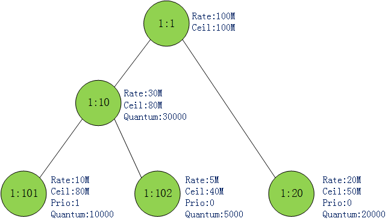
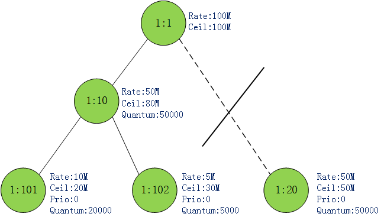
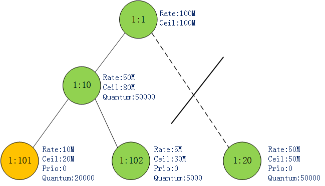
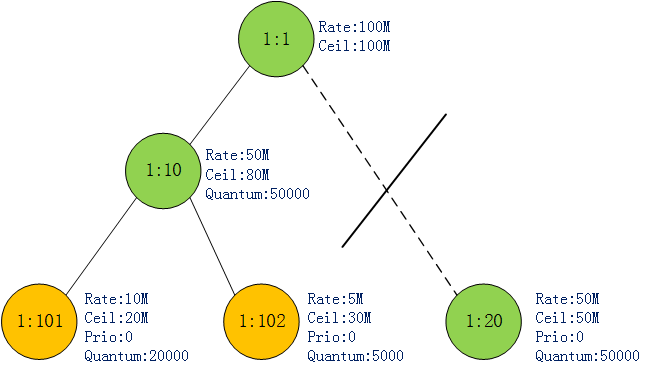
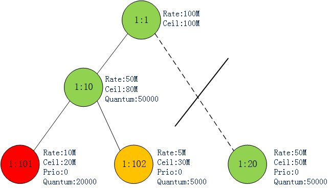
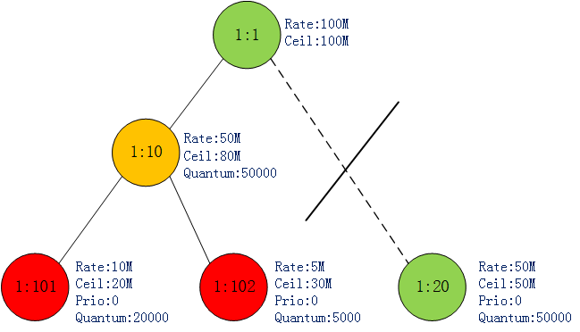

# Linux 网络Qdisc HTB

> 内核版本 linux-5.4.155

## 参数介绍

```bash
# qdisc add ... htb [default N] [r2q N]
#                      [direct_qlen P]
# default  minor id of class to which unclassified packets are sent {0}
# r2q      DRR quantums are computed as rate in Bps/r2q {10}
# debug    string of 16 numbers each 0-3 {0}
#
# direct_qlen  Limit of the direct queue {in packets}
# ... class add ... htb rate R1 [burst B1] [mpu B] [overhead O]
#                       [prio P] [slot S] [pslot PS]
#                       [ceil R2] [cburst B2] [mtu MTU] [quantum Q]
# rate     rate allocated to this class (class can still borrow)
# burst    max bytes burst which can be accumulated during idle period {computed}
# mpu      minimum packet size used in rate computations
# overhead per-packet size overhead used in rate computations
# linklay  adapting to a linklayer e.g. atm
# ceil     definite upper class rate (no borrows) {rate}
# cburst   burst but for ceil {computed}
# mtu      max packet size we create rate map for {1600}
# prio     priority of leaf; lower are served first {0}
# quantum  how much bytes to serve from leaf at once {use r2q}
```

## 样例分析

```bash
tc qdisc add dev eth0 root handle 1: htb
tc class add dev eth0 parent 1:  classid 1:1  htb rate 100mibps
tc class add dev eth0 parent 1:1 classid 1:10 htb rate 30mibps ceil 80mibps prio 0 burst 10kbit cburst 20kbit quantum 30000
tc class add dev eth0 parent 1:1 classid 1:20 htb rate 20mibps ceil 50mibps prio 1 burst 10kbit cburst 20kbit quantum 20000
tc class add dev eth0 parent 1:10 classid 1:101 htb rate 10mibps ceil 80mibps prio 1 burst 10kbit cburst 20kbit quantum 10000
tc class add dev eth0 parent 1:10 classid 1:102 htb rate 5mibps ceil 40mibps prio 0 burst 10kbit cburst 20kbit quantum 5000
```

首先创建了一个htb队列，在队列中创建了5个类，他们之间的关系可以表示成上图这样的一棵树。一些关键参数也标出来了，后面会解释。



下面用iptables将流量分类，根据目的ip，将相应的流量分类到1:20 1:101 1:102三个类队列中。这里有两点要说明：

1. 分类流量又很多方式，例如cgroup，iptables，tc filter等工具。但本文中重心在于流量如何出，所以网络包如何进入相应的类队列就省略了。
2. **流量只能缓存在树的叶节点**，其他类节点是不能缓存流量的。但inner class对于不同子类能共享带宽起到重要作用。

**htb 虽然为每个类设定了rate，但并不是说每个类只能以设定的 rate 出包**. 当网卡比较空闲时，leafclass 是可以以高于 rate 的速率出包的. 但**不能高于 ceil.** 一句话来说就是闲时共享，忙时按照比例 (这个比例是 rate, quantum 共同决定的) 分配带宽。**网络包只能入 / 出 leafclass**，innerclass 对于不同子类能共享带宽起作用。

图1中还为每个 leaf class 标注出了 priority 属性。htb 对类支持 0-7 8 个优先级，0 优先级最高。优先级越高的类可以优先出流量。

### 原理介绍

某个时刻每个类可以处于三种状态中的一种：

* **CAN_SEND**(令牌充足的，发送的网络包小于 rate，例图中用绿色表示)
* **MAY_BORROW**(没有令牌，但可向上层借用令牌以发送包。发送的网络包大于 rate 小于 ceil，例图中用黄色表示)
* **CANT_SEND**(没有令牌且不可借用，发送的网络包大于ceil，例图中用红色表示)

**htb 是如何决策哪个类出队的？**

1. htb 算法从类树的底部开始往上找 CAN_SEND 状态的 class。如果找到**某一层**有 CAN_SEND 状态的类则停止。
2. 如果该层中有多个 class 处于 CAN_SEND 状态则选**取优先级最高** (priority 最小) 的 class。
3. 如果最高优先级还是有多个 class，那就在这些类中**轮询处理**。每个类每发送自己的 quantum 个字节后，轮到下一个类发送。
4. 上面**有讲到只有 leaf class 才可以缓存网络包**，inner class 是没有网络包的。如果步骤 1, 2 最终选到了 inner class 怎么处理？既然是 inner class，肯定有自己的 subclass。inner class 会顺着树往下找，找到一个子孙 leaf class。**并且该 leaf class 处于 MAY_BORROW 状态**，将自己富余的令牌借给该 leaf class 让其出包。同样的道理，可能会有多个子孙 leaf class 处于 MAY_BORROW 状态，这里的处理跟步骤 2 是一样的。

多个子类共享父类带宽也就体现在这里了。假设父类富余了 10MB，子类 1 的 quantum 为 30000，子类 2 的 quantum 为 20000。那么父类帮子类 1 发送 30000byte，再帮子类 2 发送 20000byte。依次循环。最终效果就是子类 1 借到了 6MB，子类 2 借到了 4MB。因此上文说，当子类之间共享带宽时，rate/quantum 共同决定它们分得的带宽。rate 处于 CAN_SEND 状态时能发送多少字节，quantum 决定处于 MAY_BORROW 状态时可借用令牌发送多少字节。

### 场景举例

1. 假设某一时刻，1:101，1:102 都有网络包堆积，并且都处于 CAN_SEND 状态. 1:20 因为没有流量因此可视为没有这个节点. 图 2 所示:

     

   按照前面说的，1:101, 1:102 这两个类都属于同一层，优先级相同. htb 轮询它们出包. 1:101 每轮发送 20000byte,1:102 每轮发送 5000byte.

2. 某一时刻 1:101 发送的流量超过了其 rate 值 (10MB)，但未超过其 ceil 值 (20MB). 因此 1:101 状态转变成 MAY_BORROW 状态. 如图 3:

    

3. 此时最底层只有 1:102 这个类是 CAN_SEND，只能全力出这个类的包了. 当 1:102 发送的流量超过其 rate 值 (5MB) 时，其状态也变为 MAY_BORROW. 如图 4:

   

4. 这时最底层已经没有 CAN_SEND 状态的类了. 网上找到 1:10.1:10 的两个子类此时都处于 MAY_BORROW 状态，因此 1:10 又轮询着发送 1:101,1:102 的包. 每轮还是发送它们对应的 quantum 值.  很快 1:101 发送的流量达到其 ceil 值 (20MB) 了，此时 1:101 状态变成 CANT_SEND. 如图 5:

   

5. 此时 1:10 只能全力发送 1:102 的包. 直到达到其 ceil 值 (30MB). 此时 1:102 变为 CANT_SEND,1:101 和 1:102 累计发送了 50MB 数据，达到了其父类 1:10 的 rate 值，因此 1:10 变为 MAY_BORROW. 如图 6:

   

### 核心代码

几个核心数据结构，这里就不贴了:
struct Qdisc: tc 队列
struct htb_class:  htb 类
网络包从协议栈出来经驱动送往网卡之前，会做一个入队 / 出队操作. 这也就是 tc 的入口.
当我们使用 htb 算法时，出包回调为 htb_dequeue,htb_dequeue 返回一个 skb 给网卡发送.

```
static struct sk_buff *htb_dequeue(struct Qdisc *sch)
{
    ...
    for(level = 0; level < TC_HTB_MAXDEPTH; level++) {   // 逐层找.这里level是反的,0层表示最底层.
        /* common case optimization - skip event handler quickly */
        int m;
        ...
        m = ~q->row_mask[level];
        while(m !=(int)(-1)) {        // 同一层取优先级高的
            int prio = ffz(m);
            m |= 1 << prio;
            skb = htb_dequeue_tree(q, prio, level);   //出包
            if(likely(skb != NULL)) {
                sch->q.qlen--;
                sch->flags &= ~TCQ_F_THROTTLED;
                goto fin;
            }
        }
    }
    sch->qstats.overlimits++;
    ...
fin:
    return skb;
}
```

htb_dequeue 找到对应的层数和优先级之后调用 htb_dequeue_tree，只列出 htb_dequeue_tree 中核心代码:

```
static struct sk_buff *htb_dequeue_tree(struct htb_sched *q, int prio, int level)
{
    struct sk_buff *skb = NULL;
    struct htb_class *cl, *start;
    ...
    cl = htb_lookup_leaf(q->row[level] + prio,prio, q->ptr[level] + prio,  // 找到该level 该priority下的一个leafclass
                   q->last_ptr_id[level] + prio);

    skb = cl->un.leaf.q->dequeue(cl->un.leaf.q);     // 出包

    if(likely(skb != NULL)) {
        cl->un.leaf.deficit[level] -= qdisc_pkt_len(skb);  //deficit[level] 扣掉该包的byte数
        if(cl->un.leaf.deficit[level] < 0) {              //当deficit[level]<0时说明该类已经发送了quantum.需要发送下一个类了.
            cl->un.leaf.deficit[level] += cl->quantum;
            htb_next_rb_node((level ? cl->parent->un.inner.ptr : q->
                      ptr[0]) + prio);
        }
        htb_charge_class(q, cl, level, skb);    // 更新令牌.
    }
    return skb;
}
```

因为不确定传进来的 level 是不是最底层，因此调用 htb_lookup_leaf 保证得到的 class 是 leafclass. 其中参数 (q->ptr[level] + prio) 记录该层该优先级当前应该发那个 leafclass.
skb = cl->un.leaf.q->dequeue(cl->un.leaf.q) 出包.
当出队一个数据包时，类对应的 deficit[level] 扣减包的 byte 数，当 deficit[level]<0 时说明该类已经发送了 quantum. 于是虽然再次给 deficit[level] 加了 quantum，但是 htb_next_rb_node((level ? cl->parent->un.inner.ptr : q->ptr[0]) + prio) 已经将该层该优先级的出包类指针指向下一个类了. 下发出包，将会出另一个类.
可以对比前面提到的 1:101,1:102 轮流出包.
htb_charge_class 最后更新令牌. 看下 htb_charge_class:

```c
static void htb_charge_class(struct htb_sched *q, struct htb_class *cl,int level, struct sk_buff *skb)
{
    int bytes = qdisc_pkt_len(skb);
    enum htb_cmode old_mode;
    long diff;

    while(cl) {        //这里是一个循环,子类发包,是同时要扣子类和父类的令牌的.
        diff = psched_tdiff_bounded(q->now, cl->t_c, cl->mbuffer);
        if(cl->level >= level) {
            if(cl->level == level)         //令牌的生产,扣减在这里.
                cl->xstats.lends++;
            htb_accnt_tokens(cl, bytes, diff);
        } else {
            cl->xstats.borrows++;
            cl->tokens += diff; /* we moved t_c; update tokens */
        }
        htb_accnt_ctokens(cl, bytes, diff);
        cl->t_c = q->now;

        old_mode = cl->cmode;
        diff = 0;
        htb_change_class_mode(q, cl, &diff);        //判断是不是要切换状态了.
        if(old_mode != cl->cmode) {
            if(old_mode != HTB_CAN_SEND)
                htb_safe_rb_erase(&cl->pq_node, q->wait_pq + cl->level);
            if(cl->cmode != HTB_CAN_SEND)
                htb_add_to_wait_tree(q, cl, diff);
        }
        cl = cl->parent;
    }
}
```

子类发包同时要口父类的令牌很好理解，本质上子机就是再用父类的带宽. 但是当父类令牌富余借给子机出包时，只需从父类开始到祖先扣令牌. 子机会更新这个周期生产的令牌，但不会扣了，因为是借用父类的令牌发包的.
令牌计算完后，更改 class 的状态. 大体上就是这样，不再深入了.
为了描述方便，有些地方写的跟代码细节有差别. 见谅.

## 结构体介绍

### htb_cmode 结点状态

```c
enum htb_cmode {    // htb 每个节点的状态，只能是这三种之一！
    HTB_CANT_SEND,        /* class can't send and can't borrow */
    HTB_MAY_BORROW,        /* class can't send but may borrow */
    HTB_CAN_SEND        /* class can send */
};
```

### htb_prio 优先级？

```c
struct htb_prio {
    union {
        struct rb_root    row;
        struct rb_root    feed;
    };
    struct rb_node    *ptr;
            /* When class changes from state 1->2 and disconnects from
            * parent's feed then we lost ptr value and start from the
            * first child again. Here we store classid of the
            * last valid ptr (used when ptr is NULL).
            */
    u32        last_ptr_id;
};
```

### htb_class 类结构

```c
struct htb_class {
    struct Qdisc_class_common common; // 通过这个和htb私有数据关联起来，见htb_change_class -> qdisc_class_hash_insert,连接到Qdisc_class_hash中的hash中
    struct psched_ratecfg rate;    // 标准发送速率，令牌率
    struct psched_ratecfg ceil;    // 发送速率上限！
    s64 buffer, cbuffer; // 令牌缓冲区/峰值缓冲区，这两个是htb令牌桶算法中的用处是：如果来了一个skb，该skb比令牌数大，
                         // 则把skb数据缓存到buffer中，等令牌够的时候把skb发送出去

    s64     mbuffer;    /* max wait time */
    u32     prio;       /* these two are used only by leaves... */
    int     quantum;    /* but stored for parent-to-leaf return */

    struct tcf_proto __rcu  *filter_list;    /* class attached filters */
    struct tcf_block    	*block;
    int     filter_cnt;     // 过滤器的数量

    int     level;          /* our level (see above) */
    unsigned int        children;   // 孩子数量
    struct htb_class    *parent;    /* parent class */

    struct net_rate_estimator __rcu *rate_est;    // 速率（字节率,包率）

    /*
     * Written often fields
     */
    struct gnet_stats_basic_packed bstats;      // 字节数, 包数统计
    struct tc_htb_xstats    xstats;    /* our special stats */ // HTB统计信息, 借出, 借入, 令牌等参数

    /* token bucket parameters */
    s64     tokens, ctokens; // 当前令牌数/峰值令牌，对应tc_htb_opt中的buffer和cbuffer
    s64     t_c;        /* checkpoint time */

    union {
        // 如果该节点是叶子节点， 则使用leaf结构, 实现具体的流控处理；
        struct htb_class_leaf {
            int     deficit[TC_HTB_MAXDEPTH];
            // 新建的htb class分类规则的默认叶子qdisc为pfifo_qdisc_ops
            struct Qdisc    *q;
        } leaf;

        // 如果非叶子节点, 使用HTB内部类别结构inner, 用于形成分类树
        struct htb_class_inner {
            struct htb_prio clprio[TC_HTB_NUMPRIO];
        } inner;
    };
    s64     pq_key;

    int     prio_activity;      /* for which prios are we active */
    enum htb_cmode  cmode;      /* current mode of the class */
    struct rb_node  pq_node;    /* node for event queue */
    struct rb_node  node[TC_HTB_NUMPRIO];    /* node for self or feed tree */

    unsigned int drops ____cacheline_aligned_in_smp;
    unsigned int    overlimits;
};
```

### htb_level 层数

```c
struct htb_level {
    struct rb_root wait_pq;
    struct htb_prio hprio[TC_HTB_NUMPRIO];
};
```

### htb_sched

```c
struct htb_sched {
    struct Qdisc_class_hash clhash;
    int defcls; /* class where unclassified flows go to */
    int rate2quantum; /* quant = rate / rate2quantum */

    /* filters for qdisc itself */
    struct tcf_proto __rcu *filter_list;
    struct tcf_block *block;

#define HTB_WARN_TOOMANYEVENTS 0x1
    unsigned int warned; /* only one warning */
    int direct_qlen;
    struct work_struct work;

    /* non shaped skbs; let them go directly thru */
    struct qdisc_skb_head direct_queue;
    u32 direct_pkts;
    u32 overlimits;

    struct qdisc_watchdog watchdog;

    s64 now; /* cached dequeue time */

    /* time of nearest event per level (row) */
    s64 near_ev_cache[TC_HTB_MAXDEPTH];

    int row_mask[TC_HTB_MAXDEPTH];

    struct htb_level hlevel[TC_HTB_MAXDEPTH];
};
```


## 函数介绍

### `Qdisc_ops`接口

```c
static struct Qdisc_ops htb_qdisc_ops __read_mostly = {
	.cl_ops		=	&htb_class_ops,
	.id		=	"htb",
	.priv_size	=	sizeof(struct htb_sched),
	.enqueue	=	htb_enqueue,
	.dequeue	=	htb_dequeue,
	.peek		=	qdisc_peek_dequeued,
	.init		=	htb_init,
	.reset		=	htb_reset,
	.destroy	=	htb_destroy,
	.dump		=	htb_dump,
	.owner		=	THIS_MODULE,
};
```

### `htb_enqueue`入队

```c
static int htb_enqueue(struct sk_buff *skb, struct Qdisc *sch, struct sk_buff **to_free)
{
	int uninitialized_var(ret);
	unsigned int len = qdisc_pkt_len(skb);	// 计算包长度
	struct htb_sched *q = qdisc_priv(sch);	// 获取私有数据块（队列）
	struct htb_class *cl = htb_classify(skb, sch, &ret);	// 将数据包分类

	if (cl == HTB_DIRECT) {
		/* enqueue to helper queue */
		if (q->direct_queue.qlen < q->direct_qlen) {
			__qdisc_enqueue_tail(skb, &q->direct_queue);
			q->direct_pkts++;
		} else {
			return qdisc_drop(skb, sch, to_free);
		}
#ifdef CONFIG_NET_CLS_ACT
	} else if (!cl) {
		if (ret & __NET_XMIT_BYPASS)
			qdisc_qstats_drop(sch);
		__qdisc_drop(skb, to_free);
		return ret;
#endif
	} else if ((ret = qdisc_enqueue(skb, cl->leaf.q,
					to_free)) != NET_XMIT_SUCCESS) {
		if (net_xmit_drop_count(ret)) {
			qdisc_qstats_drop(sch);
			cl->drops++;
		}
		return ret;
	} else {
		htb_activate(q, cl);
	}

	sch->qstats.backlog += len;
	sch->q.qlen++;
	return NET_XMIT_SUCCESS;
}
```

