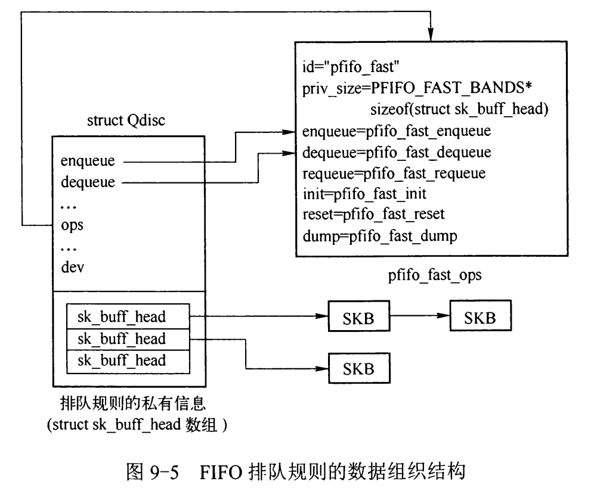
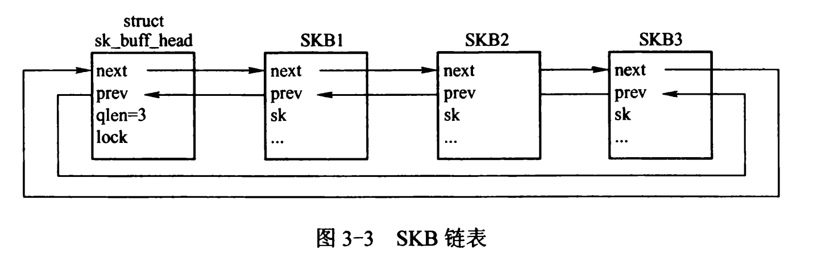

# Linux 网络Qdisc pfifo_fast

`pfifo_fast`是默认的网络调度方法，`ovs`不支持设置队列出端口调度为`pfifo_fast`，但其实现较为简单，方便理解其流程。

`pfifo_fast`有三个所谓的 “band”（可理解为三个优先级队列），编号分别为 0、1、2：

* 每个`band`上分别执行`FIFO`规则。

* 但是，如果`band 0`有数据，就不会处理`band 1`；同理，`band 1`有数据时，不会去处理`band 2`。

* 内核会检查数据包的`TOS`字段，将“最小延迟”的包放到`band 0`。priority 位于包的`TOS`字段。

* TOS 字段占用 4 个比特，各 bit 含义如下：

    ```c
      Binary Decimcal  Meaning
      -----------------------------------------
      1000   8         Minimize delay (md)
      0100   4         Maximize throughput (mt)
      0010   2         Maximize reliability (mr)
      0001   1         Minimize monetary cost (mmc)
      0000   0         Normal Service
    ```

*   第四列是对应到 Linux 内核的优先级；最后一列是映射到的`band`

    ```c
      TOS     Bits  Means                    Linux Priority    Band
      ------------------------------------------------------------
      0x0     0     Normal Service           0 Best Effort     1 1
      0x2     1     Minimize Monetary Cost   1 Filler          2 2
      0x4     2     Maximize Reliability     0 Best Effort     1 2
      0x6     3     mmc+mr                   0 Best Effort     1 2
      0x8     4     Maximize Throughput      2 Bulk            2 1
      0xa     5     mmc+mt                   2 Bulk            2 2
      0xc     6     mr+mt                    2 Bulk            2 0
      0xe     7     mmc+mr+mt                2 Bulk            2 0
      0x10    8     Minimize Delay           6 Interactive     0 1
      0x12    9     mmc+md                   6 Interactive     0 1
      0x14    10    mr+md                    6 Interactive     0 1
      0x16    11    mmc+mr+md                6 Interactive     0 1
      0x18    12    mt+md                    4 Int. Bulk       1 1
      0x1a    13    mmc+mt+md                4 Int. Bulk       1 1
      0x1c    14    mr+mt+md                 4 Int. Bulk       1 1
      0x1e    15    mmc+mr+mt+md             4 Int. Bulk       1 1
    ```

## `pfifo_fast`组织结构

FIFO排队规则比较简单，没有分类和过滤器，因此数据结构之间的关系也相对简单，Qdisc实例的操作接口指向`pfifo_fast_ops`，尾部的私有信息中也只是3个队列，如图：



其中的`sk_buff_head`就是队列，但是通过链表实现，如下图！



## 函数介绍

### 私有数据块 pfifo_fast_priv

也就是队列的数据结构

```c
#define PFIFO_FAST_BANDS 3	// band（队列数量）不可更改

// 私有数据部分，就是3个队列的实现，跟上面的图有点区别，但原理类似
struct pfifo_fast_priv {
    struct skb_array q[PFIFO_FAST_BANDS];
};
```

### `Qdisc_ops`接口

定义了实现一个排队规则所需要实现的函数！

```c
struct Qdisc_ops pfifo_fast_ops __read_mostly = {
    .id		=	"pfifo_fast",
    .priv_size	=	sizeof(struct pfifo_fast_priv),
    .enqueue	=	pfifo_fast_enqueue,	// 入队
    .dequeue	=	pfifo_fast_dequeue,	// 出队
    .peek		=	pfifo_fast_peek,	// 取出队列的首包
    .init		=	pfifo_fast_init,	// 初始化三个优先级队列
    .destroy	=	pfifo_fast_destroy,	// destroy
    .reset		=	pfifo_fast_reset,	// 恢复到初始化状态
    .dump		=	pfifo_fast_dump,	// 输出信息？
    .change_tx_queue_len =  pfifo_fast_change_tx_queue_len,
    .owner		=	THIS_MODULE,
    .static_flags	=	TCQ_F_NOLOCK | TCQ_F_CPUSTATS,
};
```

### 入队函数`enqueue`

```c
/* 
 * skb: 待插入到队列的包
 * qdisc: Qdisc结构
 * to_free: 如果要丢弃此包时，用to_free指向skb即可
 * 返回值：NET_XMIT_DROP、NET_XMIT_SUCCESS 丢弃或者成功入队
 */
static int pfifo_fast_enqueue(struct sk_buff *skb, struct Qdisc *qdisc, struct sk_buff **to_free)
{
    // 根据skb中的优先级判断此包应该放入哪个队列(band)，0，1，2
    int band = prio2band[skb->priority & TC_PRIO_MAX];
    // 得到qdisc的私有数据块地址（不是具体队列的地址）
    struct pfifo_fast_priv *priv = qdisc_priv(qdisc);
    // 得到band对应的队列地址，priv->q[band]
    struct skb_array *q = band2list(priv, band);
    // 计算当前包的大小，skb
    unsigned int pkt_len = qdisc_pkt_len(skb);
    int err;
    // 入队操作，具体没看明白，如果队列满了，或者其他错误，返回error
    err = skb_array_produce(q, skb);
    // 出错了要丢弃数据包
    if (unlikely(err)) {
        if (qdisc_is_percpu_stats(qdisc))
            return qdisc_drop_cpu(skb, qdisc, to_free);
        else
            return qdisc_drop(skb, qdisc, to_free);
    }
    // 数据包入队后，要更新当前队列信息，队列长度
    qdisc_update_stats_at_enqueue(qdisc, pkt_len);
    return NET_XMIT_SUCCESS;
}
```

### 出队函数`dequeue`

```c
// 返回值：出队待发往网络设备的skb
static struct sk_buff *pfifo_fast_dequeue(struct Qdisc *qdisc)
{
    // 获得私有数据块地址
    struct pfifo_fast_priv *priv = qdisc_priv(qdisc);
    // 新建一个数据包指针，指向待出队的包
    struct sk_buff *skb = NULL;
    bool need_retry = true;
    int band;

retry:
    // 依次遍历0,1,2三个队列，如果队列0有包就出队，没有再考虑队列1
    // 注意for循环条件中有 !skb
    for (band = 0; band < PFIFO_FAST_BANDS && !skb; band++) {
        struct skb_array *q = band2list(priv, band);

        if (__skb_array_empty(q))	// 如果当前队列为空
            continue;

        skb = __skb_array_consume(q);	// 取出队列第一个包
    }
    if (likely(skb)) {
        // 取出包了，要更新信息，如队列长度等
        qdisc_update_stats_at_dequeue(qdisc, skb);
    } else if (need_retry &&
           test_bit(__QDISC_STATE_MISSED, &qdisc->state)) {
        // 各种原因没有取出包，要重新尝试取出一个包
        clear_bit(__QDISC_STATE_MISSED, &qdisc->state);
        smp_mb__after_atomic();
        need_retry = false;
        goto retry;
    } else {
        WRITE_ONCE(qdisc->empty, true);
    }

    return skb;
}
```

### 初始化函数`init`

初始化Qdisc，不同的Qdisc要实现不同的初始化函数，主要就是因为不同的Qdisc有着不同的队列结构，队列结构都是放在Qdisc的私有数据块中的，初始化Qdisc时也要为私有数据块分配空间！这里主要用来初始化三个优先级队列！

```c
static int pfifo_fast_init(struct Qdisc *qdisc, struct nlattr *opt, struct netlink_ext_ack *extack)
{
    // 获取Qdisc对应的网络设备的队列长度
    unsigned int qlen = qdisc_dev(qdisc)->tx_queue_len;
    // 获取私有数据块（队列）地址
    struct pfifo_fast_priv *priv = qdisc_priv(qdisc);
    int prio;

    /* guard against zero length rings */
    if (!qlen)
        return -EINVAL;
    // 
    for (prio = 0; prio < PFIFO_FAST_BANDS; prio++) {
        struct skb_array *q = band2list(priv, prio);
        int err;
        // 对每一个队列分配大小，qlen，实现要看 ptr_ring.h
        err = skb_array_init(q, qlen, GFP_KERNEL);
        if (err)
            return -ENOMEM;
    }

    /* Can by-pass the queue discipline */
    qdisc->flags |= TCQ_F_CAN_BYPASS;
    return 0;
}
```

## 使用TC测试pfifo_fast

-   搭建环境

    ```bash
    # 1. 删除命名空间
    ip -all netns delete
    
    # 2. 增加多个⽹络命名空间（分别对应多个⽤户主机）
    ip netns add User1
    ip netns add User2
    
    # 3. 创建多对veth对⽤于连接多个⽹络命名空间与OVS
    ip link add veth11 type veth peer name veth12
    
    # 4. 将 veth0 veth1 分别加入两个 ns
    ip link set veth11 netns User1
    ip link set veth12 netns User2
    
    # 5. 给两个 veth0 veth1 配上 IP 并启用
    ip netns exec User1 ifconfig veth11 10.0.0.1/24 up
    ip netns exec User2 ifconfig veth12 10.0.0.2/24 up
    ip netns exec User1 ifconfig veth11 up
    ip netns exec User2 ifconfig veth12 up
    
    # 6. test
    ip netns exec User1 ping 10.0.0.2
    ip netns exec User2 ifconfig
    ```

-   使用`tc`设置QoS

    ```bash
    ip netns exec User1 tc qdisc add dev veth11 root pfifo_fast
    ip netns exec User2 tc qdisc add dev veth12 root pfifo_fast
    
    # 查看
    ip netns exec User2 tc qdisc show
    # qdisc pfifo_fast 8001: dev veth12 root refcnt 2 bands 3 priomap  1 2 2 2 1 2 0 0 1 1 1 1 1 1 1 1
    ```

-   使用`iperf`测试

    (1) 正常测试

    ```bash
    # terminal 1
    root@c:pfifo# inex User1 iperf -s 
    ------------------------------------------------------------
    Server listening on TCP port 5001
    TCP window size:  128 KByte (default)
    ------------------------------------------------------------
    [  4] local 10.0.0.1 port 5001 connected with 10.0.0.2 port 40334
    [ ID] Interval       Transfer     Bandwidth
    [  4]  0.0-10.0 sec  70.2 GBytes  60.3 Gbits/sec
    
    ############################################################
    # terminal 2
    root@c:pfifo# inex User2 iperf -i 10.0.0.1
    Invalid value of '10.0.0.1' for -i interval
    Usage: iperf [-s|-c host] [options]
    Try `iperf --help' for more information.
    root@c:pfifo# inex User2 iperf -c 10.0.0.1
    ------------------------------------------------------------
    Client connecting to 10.0.0.1, TCP port 5001
    TCP window size:  340 KByte (default)
    ------------------------------------------------------------
    [  3] local 10.0.0.2 port 40334 connected with 10.0.0.1 port 5001
    [ ID] Interval       Transfer     Bandwidth
    [  3]  0.0-10.0 sec  70.2 GBytes  60.3 Gbits/sec
    ```

    (2) 设置`ToS`字段`qdisc pfifo_fast 8002: dev veth11 root refcnt 2 bands 3 priomap  1 2 2 2 1 2 0 0 1 1 1 1 1 1 1 1`
    
    ```bash
    # terminal 2
    root@c:pfifo# ip netns exec User2 iperf -c 10.0.0.1 --tos 0x10
    ------------------------------------------------------------
    Client connecting to 10.0.0.1, TCP port 5001
    TCP window size:  340 KByte (default)
    ------------------------------------------------------------
    [  3] local 10.0.0.2 port 40340 connected with 10.0.0.1 port 5001
    [ ID] Interval       Transfer     Bandwidth
    [  3]  0.0-10.0 sec  71.5 GBytes  61.4 Gbits/sec
    ```
    
    本来打算在运行iperf的同时运行ping，并将iperf的tos字段设置为最高优先级，ping设置为最低优先级，按理说，iperf的包会一直在队列中，因此ping的包会一直得不到处理....但测试下来，ping仍然正常...
    
    ```bash
    ip netns exec User2 iperf --tos 0xa -b 80000000000 -c 10.0.0.1 # set rate 80G
    ip netns exec User2 ping -Q 0x2 10.0.0.1
    ```
    
    
