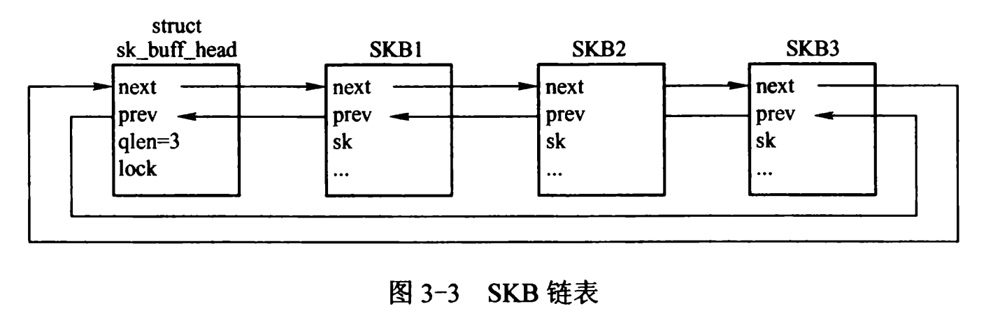

# Linux 网络Qdisc sfq

Stochastic Fairness Queueing: 随机公平排队 [tc-sfq](https://linux.die.net/man/8/tc-sfq)

随机公平排队是一种无类排队规则，可用于使用**[tc](https://linux.die.net/man/8/tc)** (8)命令进行流量控制。

SFQ 不会对流量进行整形，而只会根据**“流”**来调度数据包的传输。目标是确保公平性，以便每个流都能够依次发送数据，从而防止任何单个流淹没其余流。

## 算法

入队时，每个数据包都被分配到一个哈希桶，基于

1. 源地址
2. 目的地地址
3. 源端口

如果这些可用。SFQ 了解 ipv4 和 ipv6 以及 UDP、TCP 和 ESP。使用其他协议的数据包根据其目的地的 32 位表示和它们所属的套接字进行散列。流主要对应于 TCP/IP 连接。

这些桶中的每一个都应该代表一个独特的流。**由于多个流可能会被散列到同一个桶中，散列算法会以可配置的时间间隔进行扰动**，因此不公平只会持续很短的时间。然而，扰动可能会导致一些无意的数据包重新排序发生。

每个带有数据的 hashbucket 以轮询的方式出队。

SFQ 的编译时*最大长度（每一个流拥有包的最大数量，不是总数）*128 个数据包，最多可以分布在 1024 个可用的 128 个桶上。在溢出的情况下，在最满的桶上进行tail-drop，从而保持公平。

### 特点

-   随机性：它不是100%公平的，因此可能会哈希冲突，此时几个流会被认为是同一个流。

-   轮询：它引入了更大的延迟 than virtual clock based schemes，不应该让非交互类的流量妨碍交互类的流量。也就是说，这个调度器应该被用作CBQ或者P3这些调度器的叶子，让交互类的流量拥有更高的优先级。

-   限制：

    ```
    This implementation limits :
    - maximal queue length per flow to 127 packets.
    - max mtu to 2^18-1;
    - max 65408 flows,
    - number of hash buckets to 65536.
    ```
    
    

### 参数

-   perturb

    队列算法扰动的时间间隔（以秒为单位）。默认为 0，这意味着不会发生扰动。不要为每个扰动设置太低可能会导致一些数据包重新排序。建议值：10

-   quantum

    在一轮循环过程中允许流出队的字节数。默认为接口的 MTU，也是建议值和最小值。

## OVS中使用


## 结构介绍

`index`下标`[0 ... SFQ_MAX_FLOWS - 1]`指向`slots[]`数组，`[SFQ_MAX_FLOWS ... SFQ_MAX_FLOWS + SFQ_MAX_DEPTH]`是指向`dep[]`数组。

```c
#define SFQ_MAX_DEPTH		127 /* max number of packets per flow */
#define SFQ_DEFAULT_FLOWS	128
#define SFQ_MAX_FLOWS		(0x10000 - SFQ_MAX_DEPTH - 1) /* 65536-128 = 65408 max number of flows */
#define SFQ_EMPTY_SLOT		0xffff // 65535
#define SFQ_DEFAULT_HASH_DIVISOR 1024

struct sfq_head {
	sfq_index	next;
	sfq_index	prev;
};
```

### sfq_slot

一个`slot`就是一个流的队列，以链表的形式存储着`skb`。



```c
struct sfq_slot {
	struct sk_buff	*skblist_next;	// 同上面的sk_buff_head
	struct sk_buff	*skblist_prev;
	sfq_index	qlen; /* number of skbs in skblist */
	sfq_index	next; /* next slot in sfq RR chain，最大流数为65408时，可能只有index=1，=65408中有包，1中next就指向65408 */
	struct sfq_head dep; /* anchor in dep[] chains ？？？*/
	unsigned short	hash; /* hash value (index in ht[]) # 16bits 0-65535 为啥不用u16... */
	short		allot; /* credit for this slot */

	unsigned int    backlog;
	struct red_vars vars;	// RED 随机早期检测算法
};
```

### sfq_sched_data

sfq Qdisc的私有数据结构！

```c
struct sfq_sched_data {
/* frequently used fields */
	int		limit;		/* 在这个qdisc中包总数的限制 */
	unsigned int	divisor;	/* number of slots in hash table，流的数量？ */
	u8		headdrop;
	u8		maxdepth;	/* 每个流中最多拥有的包的数量 */

	siphash_key_t 	perturbation;
	u8		cur_depth;	/* 所有流中最大的深度 */
	u8		flags;
	unsigned short  scaled_quantum; /* SFQ_ALLOT_SIZE(quantum) */
	struct tcf_proto __rcu *filter_list;
	struct tcf_block *block;
	sfq_index	*ht;		/* Hash table ('divisor' slots) */
	struct sfq_slot	*slots;		/* Flows table ('maxflows' entries) 应该是一个数组？*/

	struct red_parms *red_parms;	// red 参数
	struct tc_sfqred_stats stats;
	struct sfq_slot *tail;		/* current slot in round，为什么不直接用index？ */

	struct sfq_head	dep[SFQ_MAX_DEPTH + 1];
					/* Linked lists of slots, indexed by depth
					 * dep[0] : list of unused flows
					 * dep[1] : list of flows with 1 packet
					 * dep[X] : list of flows with X packets
					 */

	unsigned int	maxflows;	/* 当前flow table中的流数 */
	int		perturb_period;		// 扰动的周期，以s为单位
	unsigned int	quantum;	/* 在一轮循环过程中允许流出队的字节数 Allotment per round: MUST BE >= MTU */
	struct timer_list perturb_timer;	// 定时器，每隔一段时间就要重新hash
	struct Qdisc	*sch;
};
```


## 函数分析

### sfq_qdisc_ops

```c
static struct Qdisc_ops sfq_qdisc_ops __read_mostly = {
	.cl_ops		=	&sfq_class_ops,
	.id		=	"sfq",
	.priv_size	=	sizeof(struct sfq_sched_data),
	.enqueue	=	sfq_enqueue,
	.dequeue	=	sfq_dequeue,
	.peek		=	qdisc_peek_dequeued,
	.init		=	sfq_init,
	.reset		=	sfq_reset,
	.destroy	=	sfq_destroy,
	.change		=	NULL,
	.dump		=	sfq_dump,
	.owner		=	THIS_MODULE,
};
```

### sfq_init

初始化Qdisc，确保在初始化时为Qdisc的私有数据块分配空间！

```c
static int sfq_init(struct Qdisc *sch, struct nlattr *opt,
		    struct netlink_ext_ack *extack)
{
	struct sfq_sched_data *q = qdisc_priv(sch);	// 获得私有数据块的指针
	int i;
	int err;

	q->sch = sch;
	timer_setup(&q->perturb_timer, sfq_perturbation, TIMER_DEFERRABLE);	// 初始化定时器，用于扰动

	err = tcf_block_get(&q->block, &q->filter_list, sch, extack);
	if (err)
		return err;
	
    // 这里....
	for (i = 0; i < SFQ_MAX_DEPTH + 1; i++) {
		q->dep[i].next = i + SFQ_MAX_FLOWS;
		q->dep[i].prev = i + SFQ_MAX_FLOWS;
	}

	q->limit = SFQ_MAX_DEPTH;	
	q->maxdepth = SFQ_MAX_DEPTH;
	q->cur_depth = 0;
	q->tail = NULL;
	q->divisor = SFQ_DEFAULT_HASH_DIVISOR;
	q->maxflows = SFQ_DEFAULT_FLOWS;
	q->quantum = psched_mtu(qdisc_dev(sch));
	q->scaled_quantum = SFQ_ALLOT_SIZE(q->quantum);
	q->perturb_period = 0;
	get_random_bytes(&q->perturbation, sizeof(q->perturbation));

	if (opt) {
		int err = sfq_change(sch, opt);
		if (err)
			return err;
	}

	q->ht = sfq_alloc(sizeof(q->ht[0]) * q->divisor);
	q->slots = sfq_alloc(sizeof(q->slots[0]) * q->maxflows);
	if (!q->ht || !q->slots) {
		/* Note: sfq_destroy() will be called by our caller */
		return -ENOMEM;
	}

	for (i = 0; i < q->divisor; i++)
		q->ht[i] = SFQ_EMPTY_SLOT;

	for (i = 0; i < q->maxflows; i++) {
		slot_queue_init(&q->slots[i]);
		sfq_link(q, i);
	}
	if (q->limit >= 1)
		sch->flags |= TCQ_F_CAN_BYPASS;
	else
		sch->flags &= ~TCQ_F_CAN_BYPASS;
	return 0;
}
```

### sfq_perturbation

在`sfq_init`中，对定时器进行了初始化，通过`timer_setup(&q->perturb_timer, sfq_perturbation, TIMER_DEFERRABLE);`这里用到的是低精度的定时器，它的精度在5ms左右。

```c
// 定时器的处理函数
static void sfq_perturbation(struct timer_list *t)
{
	struct sfq_sched_data *q = from_timer(q, t, perturb_timer);	// 通过字节偏移，从timer的地址推导出私有数据的首地址。
	struct Qdisc *sch = q->sch;
	spinlock_t *root_lock = qdisc_lock(qdisc_root_sleeping(sch));	// 加锁
	siphash_key_t nkey;

	get_random_bytes(&nkey, sizeof(nkey));
	spin_lock(root_lock);
	q->perturbation = nkey;
	if (!q->filter_list && q->tail)
		sfq_rehash(sch);	// rehash
	spin_unlock(root_lock);	// 解锁

	if (q->perturb_period)
		mod_timer(&q->perturb_timer, jiffies + q->perturb_period);	// 设置下一次计时。
}
```

