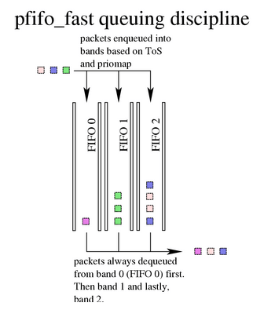
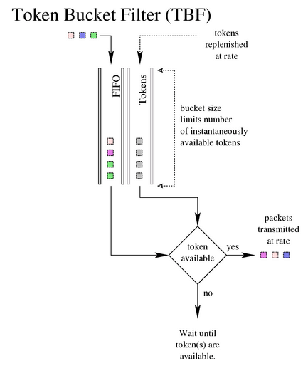
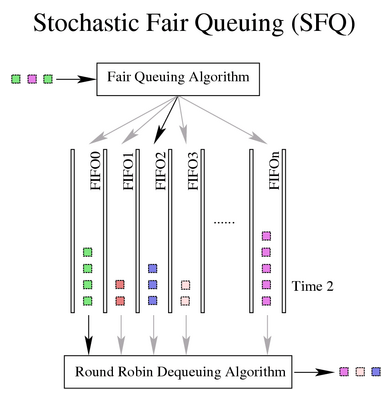
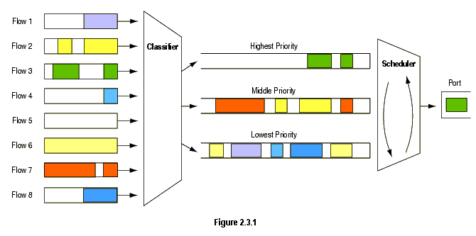
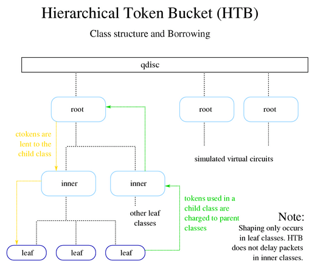

[TOC]

# Linux 流量控制(TC)

参考文献汇总：

> [用 tc qdisc 管理Linux网络带宽，原理介绍](http://arthurchiao.art/blog/lartc-qdisc-zh/)
> [Traffic-Control-HOWTO，如何使用TC](https://tldp.org/HOWTO/Traffic-Control-HOWTO/)
> [Linux内核中流量控制系列，代码分析](https://www.iteye.com/blog/cxw06023273-867318), [系列目录](https://www.iteye.com/category/131860)
> [利用TC创建HTB](https://developer.aliyun.com/article/4000)
>
> 关于tc的使用方法可看 [Linux 的高级路由和流量控制 HOWTO](https://lartc.org/LARTC-zh_CN.GB2312.pdf)

源码汇总：

> [Linux 内核net/sched](https://elixir.bootlin.com/linux/v2.6.39/source/net/sched/sch_htb.c#L856) 	`linux-5.4.155/net/sched/sch_htb.c`

## 说明

linux内核中提供了流量控制的相关处理功能，相关代码在`net/sched`目录下；而应用层上的控制是通过`iproute2`软件包中的`tc`来实现，`tc`和`sched`的关系，一个是用户层接口，一个是具体实现。**具体实现是在linux内核的sched目录下，而iproute2/tc 只是用户对QoS进行配置的工具。**

`TC` 支持的QoS队列规则分为，无分类的规则和分类的规则。详情看 [用 tc qdisc 管理 Linux 网络带宽](http://arthurchiao.art/blog/lartc-qdisc-zh)

```bash
atm              fq               multiq           red
bfifo            fq_codel         netem            rr
cbq              gred             pfifo            sfb
choke            handle           pfifo_fast       sfq
codel            hfsc             pfifo_head_drop  stab
drr              hhf              pie              tbf
dsmark           htb              prio
estimator        mqprio           qfq
```

* 简单不分类的规则
  1. **pfifo_fast（先入先出队列）** `默认排队规则`
  2. **TBF（Token Bucket Filter，令牌桶过滤器）**
  3. **SFQ（Stochastic Fairness Queueing，随机公平排队）**
* Classful qdisc（分类别排队规则）
  1. **CBQ（Class Based Queueing，基于类的排队）**：CBQ是 Class Based Queueing（基于类别排队）的缩写。它实现了一个丰富的连接共享类别结构，既有限制（shaping）带宽的能力，也具有带宽优先级别管理的能力。带宽限制是通过计算连接的空闲时间完成的。空闲时间的计算标准是数据包离队事件的频率和下层连接（数据链路层）的带宽。
  2. **HTB（Hierarchical Token Bucket，层级令牌桶）**：HTB是Hierarchy Token Bucket 的缩写。通过在实践基础上的改进，它实现一个丰富的连接共享类别体系。使用HTB可以很容易地保证每个类别的带宽，虽然它也允许特定的类可以突破带宽上限，占用别的类的带宽。HTB可以通过TBF（Token Bucket Filter）实现带宽限制，也能够划分类别的优先级。
  3. PRIO，**PRIO qdisc 不能限制带宽，因为属于不同类别的数据包是顺序离队的。**使用PRIO qdisc 可以很容易对流量进行优先级管理，只有属于高优先级类别的数据包全部发送完毕，参会发送属于低优先级类别的数据包。为了方便管理，需要使用iptables 或者 ipchains 处理数据包的服务类型（Type Of Service，TOS）。
  4. **用过滤器对流量进行分类**

## todo

SFQ为不同的session分配不同的“队列”，按照round robin方式，每个session轮流发送。对实现GCL可能可借鉴！


## 简单不分类的规则

### pfifo_fast（先入先出队列） 默认排队规则



`pfifo_fast`有三个所谓的 “band”（可理解为三个优先级队列），编号分别为 0、1、2：

* 每个`band`上分别执行`FIFO`规则。
* 但是，如果`band 0`有数据，就不会处理`band 1`；同理，`band 1`有数据时，不会去处理`band 2`。
* 内核会检查数据包的`TOS`字段，将“最小延迟”的包放到`band 0`。priority 位于包的`TOS`字段。[IP header](https://blog.csdn.net/jrunw/article/details/68093203)

**配置方式：**

```bash

```

### TBF（Token Bucket Filter，令牌桶过滤器）

TBF 是一个简单 qdisc，对于**没有超过预设速率的流量直接透传**，但也能容忍**超过预 设速率的短时抖动**（short bursts in excess of this rate）。 TBF 非常简洁，对网络和处理器都很友好（network- and processor friendly）。 **如果只是想实现接口限速，那 TBF 是第一选择。**

> 注意：在实际的实现中，**token 是基于字节数，而不是包数**。



**配置方式：**

```bash
tc qdisc add dev eth0 root tbf rate 220kbit latency 50ms burst 1540
# limit BYTES
# burst BYTES[/BYTES]
# rate KBPS
# [ mtu BYTES[/BYTES] ]
# [ peakrate KBPS ]
# [ latency TIME ]
# [ overhead BYTES ]
# [ linklayer TYPE ]
```

### SFQ（Stochastic Fairness Queueing，随机公平排队）

SFQ 中的核心是conversion（会话）或 flow（流），每个conversion对应一个FIFO queue，然后将流量分到不同 queue。发送数据时，按照round robin方式，每个session轮流发送。这种机制会产生非常公平的结果，不会因为单个 conversion 太大而把其他 conversion 的带宽都挤占掉。**SFQ 被称为 “随机的”（stochastic）是因为它其实并没有为每个 session 分配一个 queue**，而是用算法将流量哈希到了一组有限的 queue。



**配置方式：**

```bash
tc qdisc add dev eth0 root sfq perturb 10 quantum 1500 limit 10
# [ limit NUMBER ]	SFQ 能缓存的最大包数（超过这个阈值将导致丢包）
# [ perturb SECS ] 每隔多少秒就重新配置哈希算法
# [ quantum BYTES ] 在轮到下一个queue发送之前，当前queue允许出队(dequeue)的最大字节数，默认是一个MTU，不建议设置为小于MTU的值。
# [ divisor NUMBER ]
# [ flows NUMBER] 哈希槽（hash buckets）的数量
# [ depth NUMBER ]
# [ headdrop ]
# [ redflowlimit BYTES ]
# [ min BYTES ]
# [ max BYTES ]
# [ avpkt BYTES ]
# [ burst PACKETS ]
# [ probability P ]
# [ ecn ]
# [ harddrop ]
```

## Classful qdisc（分类别排队规则）

### 简介

当流量进入一个`classful qdisc`时，需要对这个包进行**分类**，也就是查询所谓的**过滤器**（`filters`），过滤器是在qdisc中被调用的，而不是其他地方，理解一点非常重要！过滤器返回一个判决结果给`qdisc`，`qdisc`据此将包`enqueue`到合适的`class`，每个`subclass`可能会进一步执行其他`filters`，以判断是否需要进一步处理。

**所有 qdiscs、classes 和 filters 都有 ID，这些 ID 可以是指定的，也可以是自动分的。**
每个qdisc和class都会分配一个相应的handle（句柄），可以指定handle对`qdisc`进行配置。

ID 格式 `major:minor`，`major` 和 `minor` 都是 16 进制数字`(65536)`，不超过 2 字节。 两个特殊值：

- `root` 的 `major` 和 `minor` 初始化全 1。
- 省略未指定的部分将为全 0。

下面分别介绍以上三者的 ID 规范。

- qdisc：qdisc 可能会有 children。
  - `major` 部分：称为 `handle`，表示的 qdisc 的唯一性。
  - `minor` 部分：留给 class 的 namespace。
- class：class 依托在 qdisc 内，
  - `major` 部分：继承 class 所在的 qdisc 的 `major`。
  - `minor` 部分：称为 classid，在所在的 qdisc 内唯一就行。
- filter：由三部分构成，只有在使用 hashed filter hierarchy 时才会用到。

#### 如何用过滤器对流量进行分类

对包分类时会一直分类到叶子节点！综上，一个典型的 handle 层级如下：

```bash
                     1:   root qdisc
                      |
                     1:1    child class
                   /  |  \
                  /   |   \
                 /    |    \
             1:10   1:11   1:12   child classes
              |       |      |
              |      11:     |    leaf class  # 叶子类
              |              |
             10:            12:   qdisc  # 这里qdisc也是嵌套了
            /   \          /   \
          10:1  10:2     12:1  12:2   leaf classes
```

但不要被这棵树迷惑！不要以为内核位于树的顶点，网络位于下面。**包只会通过 root qdisc 入队或出队**，这也是内核唯一与之交互的部分，一个包可能会被链式地分类如下：

```bash
1: -> 1:1 -> 1:12 -> 12: -> 12:2
```

后到达 attach 到 `class 12:2` 的 qdisc 的队列。在这个例子中，树的每个“节点”（ node）上都 attach 了一个 filter，每个 filter 都会给出一个判断结果，根据判断结果选择一个合适的分支将包发送过去。**这是常规的流程**。但下面这种流程也是有可能的：

```bash
1: -> 12:2
```

在这种情况下，attach 到 root qdisc 的 filter 决定直接将包发给 `12:2`。

#### 包是如何从 qdisc 出队然后交给硬件的

当内核决定从 qdisc dequeue packet 交给接口（interface）发送时，它会

1. 向 root qdisc `1:` 发送一个 dequeue request
2. `1:` 会将这个请求转发给 `1:1`，后者会进一步向下传递，转发给 `10:`、`11:`、`12:`
3. 每个 qdisc 会查询它们的 siblings，并尝试在上面执行 `dequeue()` 方法。

**简单来说，嵌套类只会和它们的`parent qdiscs`通信，而永远不会直接和接口交互。内核只会调用`root qdisc`的`dequeue()`方法！**

在这个例子中，内核需要遍历整棵树，因为只有`12:2`中有数据包。

最终结果是，classes dequeue的速度永远不会超过它们的parents允许的速度。而这正是我们所期望的：这样就能在内层使用一个SFQ做纯调度，它不用做任何整形的工作；然后在外层使用一个整形qdisc专门负责整形。

### PRIO qdisc（优先级排队规则）

`PRIO` qdisc实际上不会整形，只会根据设置的过滤器对流量分类。可以将`PRIO` qdisc理解为`pfifo_fast` qdisc的升级版，它也有多个band，但每个band都是一个独立的class，而不是简单的FIFO。



band 0对应的minor number是1！band 1对应的minor number是2，以此类推

**配置方式：**

```bash
#           1:   root qdisc
#          / | \
#         /  |  \
#        /   |   \
#      1:1  1:2  1:3    classes
#       |    |    |
#      10:  20:  30:    qdiscs    qdiscs
#      sfq  tbf  sfq
# band  0    1    2
tc qdisc add dev eth0 root handle 1: prio   # This *instantly* creates classes 1:1, 1:2, 1:3
tc qdisc add dev eth0 parent 1:1 handle 10: sfq
tc qdisc add dev eth0 parent 1:2 handle 20: tbf rate 20kbit buffer 1600 limit 3000
tc qdisc add dev eth0 parent 1:3 handle 30: sfq
```

### CBQ（Class Based Queueing，基于类的排队）

不要将广义上基于类别的排队等同于 CBQ！CBQ只是其中的一类。

CBQ（Class Based Queueing，基于类的排队）是最复杂、最花哨、最少被理解、也可能是最难用对的qdisc。这并非因为它的发明者都是魔鬼或者能力不够，而是因为 CBQ 算法经常不够精确，而这是由于它与 Linux 的工作方式不是太匹配造成的。

除了是 classful qdisc 之外，CBQ还是一个整流器（shaper），除了是 classful qdisc 之外，CBQ 还是一个整流器（shaper），作为一个整流器来说， 其实它工作地并不是非常理想。理想的工作方式应该是这样的：如果想将一个 10Mbps 的连接整形为 1Mbps，那这条链路应该有 90% 的时间是空闲的。否则，我们就需要 throttle 来确保链路 90% 的时间是空闲的。但空闲时间是很难测量的，CBQ 的方式是：用硬件层连续两次请求数据的时间间隔（ 毫秒）来推算。

### HTB（Hierarchical Token Bucket，层级令牌桶）

Martin Devera (devik) 意识到 CBQ 太复杂了，并且没有针对很多典型的场景进行优化。因此他设计了 HTB，这种层级化的方式对下面这些场景很适用：

- 有一个固定总带宽，想将其分割成几个部分，分别用作不同目的
- 每个部分的带宽是有保证的（guaranteed bandwidth）
- 还可以指定每个部分向其他部分借带宽



**HTB 的工作方式与 CBQ 类似，但不是借助于计算空闲时间（idle time）来实现整形**。 在内部，它其实是一个 classful TBF（令牌桶过滤器）—— 这也是它叫层级令牌桶（HTB） 的原因。HTB 的参数并不多，在它的[网站](http://luxik.cdi.cz/~devik/qos/htb/)文档 里都已经写的很明确了。

**配置方式：**

```bash
# qdisc add ... htb [default N] [r2q N]
#                      [direct_qlen P]
# default  minor id of class to which unclassified packets are sent {0}
# r2q      DRR quantums are computed as rate in Bps/r2q {10}
# debug    string of 16 numbers each 0-3 {0}
#
# direct_qlen  Limit of the direct queue {in packets}
# ... class add ... htb rate R1 [burst B1] [mpu B] [overhead O]
#                       [prio P] [slot S] [pslot PS]
#                       [ceil R2] [cburst B2] [mtu MTU] [quantum Q]
# rate     rate allocated to this class (class can still borrow)
# burst    max bytes burst which can be accumulated during idle period {computed}
# mpu      minimum packet size used in rate computations
# overhead per-packet size overhead used in rate computations
# linklay  adapting to a linklayer e.g. atm
# ceil     definite upper class rate (no borrows) {rate}
# cburst   burst but for ceil {computed}
# mtu      max packet size we create rate map for {1600}
# prio     priority of leaf; lower are served first {0}
# quantum  how much bytes to serve from leaf at once {use r2q}

tc qdisc add dev eth0 root handle 1: htb default 30
tc class add dev eth0 parent 1: classid 1:1 htb rate 6mbit burst 15k

tc class add dev eth0 parent 1:1 classid 1:10 htb rate 5mbit burst 15k
tc class add dev eth0 parent 1:1 classid 1:20 htb rate 3mbit ceil 6mbit burst 15k
tc class add dev eth0 parent 1:1 classid 1:30 htb rate 1kbit ceil 6mbit burst 15k
```

### 用过滤器对流量进行分类

