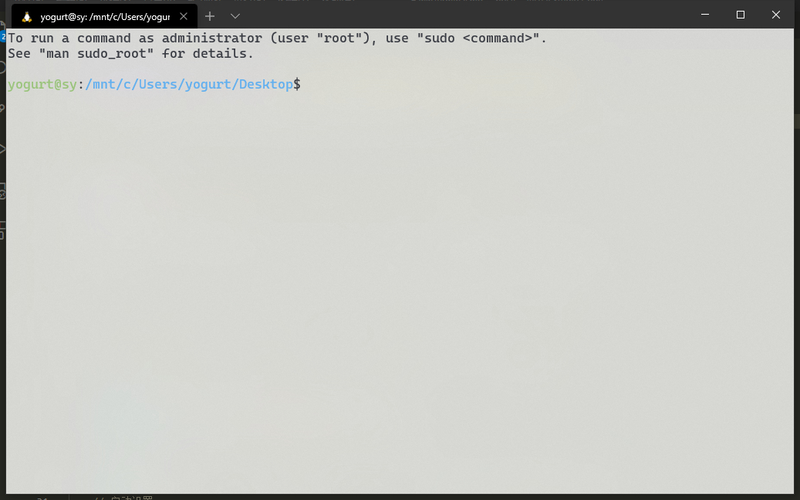
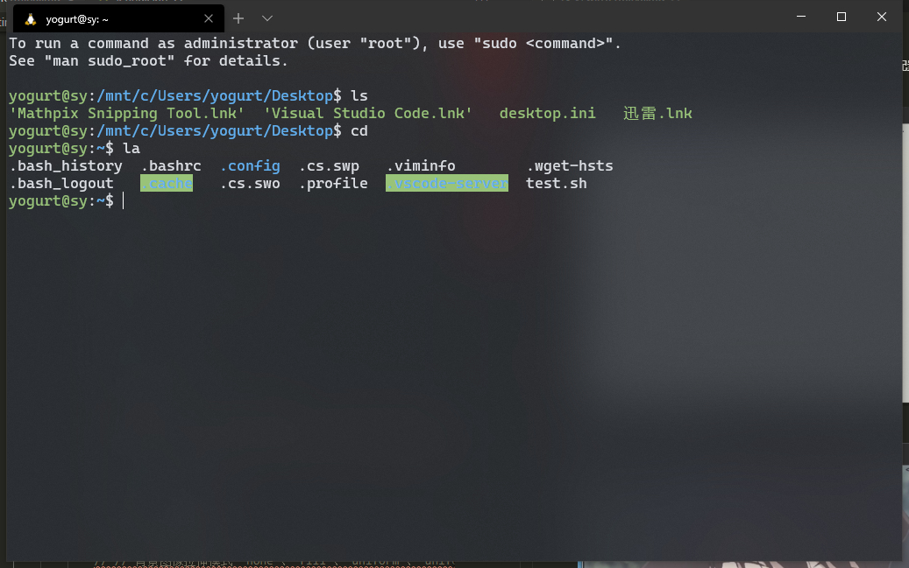
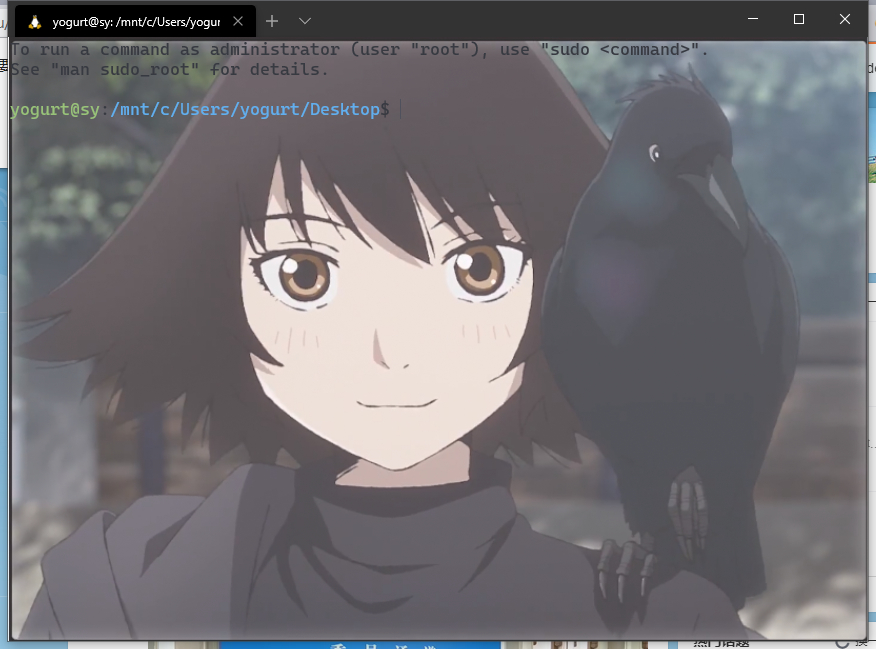
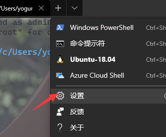

[官方文档，如果要自己修改，就好好看看](https://docs.microsoft.com/zh-cn/windows/terminal/)

下面的主要是我根据 官方文档  修改的 windows terminal 的配置，效果如下，

效果预览1， 未使用背景图片，白色主题

黑色主题

效果预览2， 使用背景图片



# 美化

修改配置文件的位置： 点击箭头，在点击设置



## 一定要先备份一下 默认的设置 ！！！

使用方法：就将下面的内容复制后，替换设置中的内容即可，不过还是有几个地方需要你修改一下，后面有说明

```json
// This file was initially generated by Windows Terminal 1.0.1401.0
// It should still be usable in newer versions, but newer versions might have additional
// settings, help text, or changes that you will not see unless you clear this file
// and let us generate a new one for you.
// To view the default settings, hold "alt" while clicking on the "Settings" button.
// For documentation on these settings, see: https://aka.ms/terminal-documentation
{
    "$schema": "https://aka.ms/terminal-profiles-schema",
    // 默认使用的终端 (ubuntu/powershell/cmd....)
    "defaultProfile": "{c6eaf9f4-32a7-5fdc-b5cf-066e8a4b1e40}",
    // You can add more global application settings here.
    // To learn more about global settings, visit https://aka.ms/terminal-global-settings
    // 主题设置
    "theme": "dark", // --------- 这里有改动 ------------- "dark/light/system" 就标题栏有变化....
    // 启动设置
    // 1、以最大化方式启动
    "launchMode": "default", // "maximized"
    // 2、启动位置
    "initialPosition": "100,50",
    // 3、首次启动时的列
    "initialCols": 100,
    // 4、首次启动时的行
    "initialRows": 30,
    // If enabled, selections are automatically copied to your clipboard.
    "copyOnSelect": true, // --- 这里有改动 ----默认 false  ， 选中复制，右键粘贴
    // If enabled, formatted data is also copied to your clipboard
    "copyFormatting": false,
    // 滚动速度
    "rowsToScroll": "system", // 这是滚动鼠标滚轮一次滚动的行数 默认 "system"
    // A profile specifies a command to execute paired with information about how it should look and feel.
    // Each one of them will appear in the 'New Tab' dropdown,
    //   and can be invoked from the commandline with `wt.exe -p xxx`
    // To learn more about profiles, visit https://aka.ms/terminal-profile-settings
    "profiles": {
        "defaults": {
            // 初始目录设置
            "startingDirectory": "C:/Users/yogurt/Desktop/",
            // 文本设置
            // 字体
            "fontFace": "Cascadia Mono",
            // 字体大小
            "fontSize": 13,
            // 边距
            "padding": "2,2,2,2",
            // 消除文本锯齿
            "antialiasingMode": "cleartype",
            // 颜色设置
            // 配色方案,   配色方案是在 schemes 对象中定义的, 有几个预先定义的方案， 查看 https://docs.microsoft.com/zh-cn/windows/terminal/customize-settings/color-schemes
            "colorScheme": "One Half Dark", // One Half Dark,  One Half Light,  Solarized Dark,  Solarized Light, 
            // Acrylic 设置
            "useAcrylic": true,
            // Acrylic 不透明度
            "acrylicOpacity": 0.8,  
            // // 背景图像设置
            // "backgroundImage":  "C:/Users/yogurt/Pictures/Saved Pictures/background.png",
            // // 背景图像拉伸模式 "none"、"fill"、"uniform"、"uniformToFill"
            // "backgroundImageStretchMode": "uniform",
            // // 背景图像不透明度
            // "backgroundImageOpacity": 0.8,
            // 历史记录可现实行数
            "historySize": 9001 // default 9001 
        },
        "list": [
            {
                // Make changes here to the powershell.exe profile.
                "guid": "{61c54bbd-c2c6-5271-96e7-009a87ff44bf}",
                "name": "Windows PowerShell",
                "commandline": "powershell.exe",
                "hidden": false
            },
            {
                // Make changes here to the cmd.exe profile.
                "guid": "{0caa0dad-35be-5f56-a8ff-afceeeaa6101}",
                "name": "命令提示符",
                "commandline": "cmd.exe",
                "hidden": false
            },
            {
                "guid": "{c6eaf9f4-32a7-5fdc-b5cf-066e8a4b1e40}",
                "hidden": false,
                "name": "Ubuntu-18.04",
                "source": "Windows.Terminal.Wsl"
            },
            {
                "guid": "{b453ae62-4e3d-5e58-b989-0a998ec441b8}",
                "hidden": false,
                "name": "Azure Cloud Shell",
                "source": "Windows.Terminal.Azure"
            }
        ]
    },
    // Add custom color schemes to this array.
    // To learn more about color schemes, visit https://aka.ms/terminal-color-schemes
    // 自定义配色方案， 我觉得没必要。。。不折腾.....   
    "schemes": [],


    // Add custom keybindings to this array.
    // To unbind a key combination from your defaults.json, set the command to "unbound".
    // To learn more about keybindings, visit https://aka.ms/terminal-keybindings
    "keybindings": [
        // Copy and paste are bound to Ctrl+Shift+C and Ctrl+Shift+V in your defaults.json.
        // These two lines additionally bind them to Ctrl+C and Ctrl+V.
        // To learn more about selection, visit https://aka.ms/terminal-selection
        {
            "command": {
                "action": "copy",
                "singleLine": false
            },
            "keys": "ctrl+c"
        },
        {
            "command": "paste",
            "keys": "ctrl+v"
        },
        // Press Ctrl+Shift+F to open the search box
        {
            "command": "find",
            "keys": "ctrl+shift+f"
        },
        // Press Alt+Shift+D to open a new pane.
        // - "split": "auto" makes this pane open in the direction that provides the most surface area.
        // - "splitMode": "duplicate" makes the new pane use the focused pane's profile.
        // To learn more about panes, visit https://aka.ms/terminal-panes
        {
            "command": {
                "action": "splitPane",
                "split": "auto",
                "splitMode": "duplicate"
            },
            "keys": "alt+shift+d"
        },
        // 下面是我自定义的快捷键
        {
            "command": "closePane",
            "keys": "ctrl+w"
        },
        {
            "command": "closeTab",
            "keys": "ctrl+shift+w"
        }
    ]
}
```

## 需要自己修改的地方

* list： 这个要使用你自己的默认设置里面的内容
```
        "list": [
            {
                // Make changes here to the powershell.exe profile.
                "guid": "{61c54bbd-c2c6-5271-96e7-009a87ff44bf}",
                "name": "Windows PowerShell",
                "commandline": "powershell.exe",
                "hidden": false
            },
            {
                // Make changes here to the cmd.exe profile.
                "guid": "{0caa0dad-35be-5f56-a8ff-afceeeaa6101}",
                "name": "命令提示符",
                "commandline": "cmd.exe",
                "hidden": false
            },
            {
                "guid": "{c6eaf9f4-32a7-5fdc-b5cf-066e8a4b1e40}",
                "hidden": false,
                "name": "Ubuntu-18.04",
                "source": "Windows.Terminal.Wsl"
            },
            {
                "guid": "{b453ae62-4e3d-5e58-b989-0a998ec441b8}",
                "hidden": false,
                "name": "Azure Cloud Shell",
                "source": "Windows.Terminal.Azure"
            }
```
* 默认配置： "defaultProfile": "{c6eaf9f4-32a7-5fdc-b5cf-066e8a4b1e40}"， 根据你的`list`选择对应的`guid`的值
* 初始目录： "startingDirectory": "C:/Users/yogurt/Desktop/",  这里的用户名自己修改
* 背景图像： "backgroundImage":  "C:/Users/yogurt/Pictures/Saved Pictures/background.png",  修改为自己的图片地址

# 使用 (快捷键)

有些快捷键是预定义的，在上面的配置文件里面看不到，[官方文档相关路径](https://docs.microsoft.com/zh-cn/windows/terminal/customize-settings/key-bindings)

键位 | 功能
|:-|:-|
alt+f4 | 关闭窗口 
ctrl+shift+f | 查找
ctrl+shift+space | 打开下拉菜单
f11 或 alt+enter | 切换全屏
ctrl+shift+d | 复制当前选项卡
ctrl+shift+t | 新建选项卡
ctrl+tab | 打开下一个选项卡
alt+方向键 | 移动窗格焦点
alt+shift+plus | 垂直拆分窗格
alt+shift+ - | 水平拆分窗格
ctrl+w | 关闭当前窗口
ctrl+shift+w | 关闭当前窗口，分割后的
ctrl+ = | 调大字号
ctrl+ - | 调小字号

目前好像还没有快速切换主题色的方法.....
