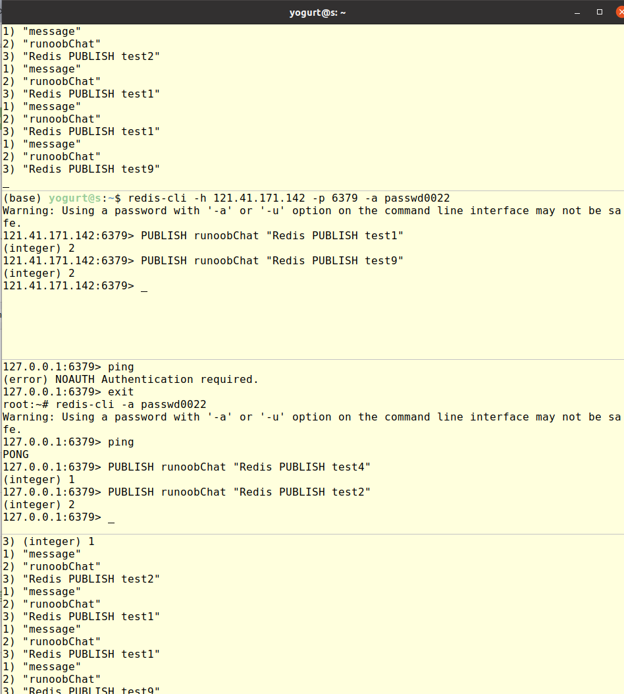

# redis

> [redis 菜鸟教程](https://www.runoob.com/redis/redis-tutorial.html)

1. ubuntu 安装 redis 数据库

```bash
sudo apt install redis-server
```


2. 启动数据库时，默认使用的配置文件路径在`/etc/redis/redis.conf`，可配置的内容很多，主要有

```bash
protected-mode yes	# 保护模式，禁止其他主机在无密码的方式下访问本机的redis-server
port 6379
dir /var/lib/redis	# 文件存放路径
bind 127.0.0.1 ::1	# 允许指定地址的host访问server，如果要全部都能访问，注释掉该行
# 注意，即使注释掉了bind，但protect-mode 启动了的，并且没有给server设置密码，外部仍然无法访问
requirepass passwd0022	# 设置server密码，默认不带密码！！！
```


3. 启动数据库

```bash
redis-server  						# 不指定则使用默认配置文件（远程连接有问题）
redis-server /etc/redis/redis.conf	# 使用指定的默认配置文件
redis-server --port 6389    		# 指定端口号
```


4. redis-cli 连接数据库

```bash
root:redis# redis-cli 		# 1. 未设置密码时，直接本地连接
127.0.0.1:6379> ping		# 2. 测试是否连接成功
PONG

root:redis# redis-cli 		
127.0.0.1:6379> shutdown 	# 3. 关闭数据库服务, sometimes not work, need root?
not connected> 

/etc/init.d/redis-server restart    
/etc/init.d/redis-server stop       # 3. 停止服务
/etc/init.d/redis-server start

root:~# redis-cli
127.0.0.1:6379> ping
PONG
127.0.0.1:6379> config get requ* 	# 4. 查看配置信息
1) "requirepass"					# 此时未设置密码
2) ""

root:~# redis-cli 
127.0.0.1:6379> config get requ*	# 5. 设置密码后，未验证密码前，无法进行操作
(error) NOAUTH Authentication required.	
127.0.0.1:6379> AUTH "passwd0022"	# 6. 通过AUTH验证密码，成功即可正常进行操作
OK

root:~# redis-cli -a passwd0022		# 7. 也可在连接时，指定密码
Warning: Using a password with '-a' or '-u' option on the command line interface may not be safe.
127.0.0.1:6379> ping
PONG

# 8. 远端连接，注意给服务器配置安全规则，开放6379端口
yogurt$ redis-cli -h 121.x.x.142 -p 6379 -a passwd0022
121.41.171.142:6379> ping
PONG
```


5. [发布订阅测试](https://www.runoob.com/redis/redis-pub-sub.html)，支持多发多收

   

